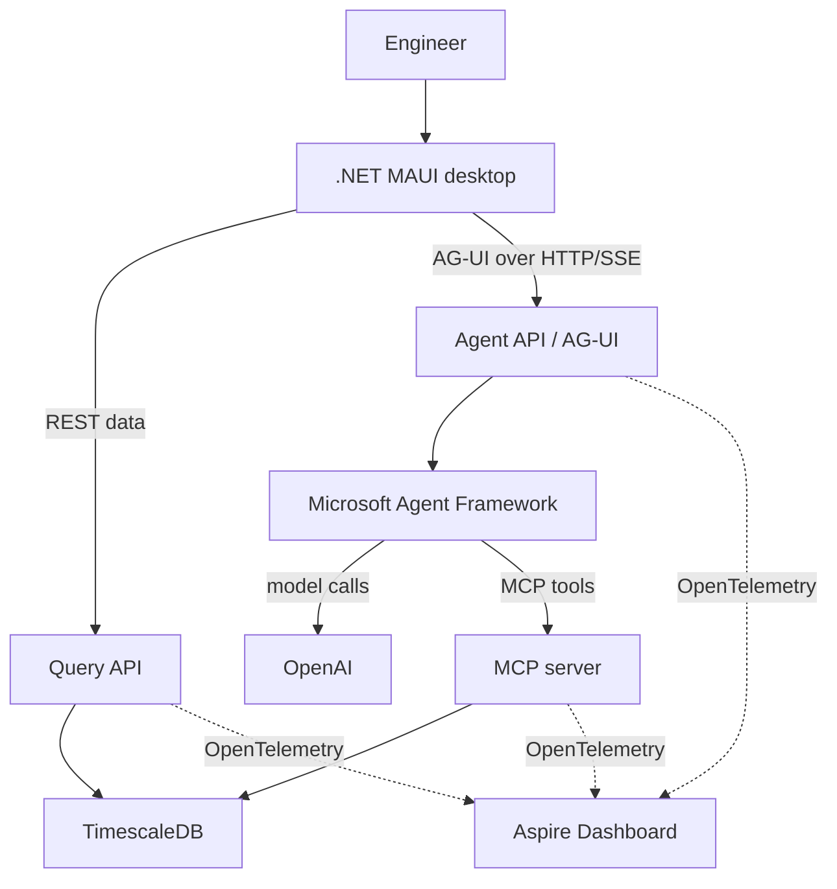

# Implementation Plan: Server-Side AG-UI Agent for Race Telemetry Workbench

## Objective

Replace the current client-side/in-process AI design with a server-side agent architecture so that:

- the .NET MAUI desktop application never stores or receives the OpenAI API key;
- the frontend communicates with the agent through the AG-UI protocol;
- Microsoft Agent Framework owns the agent and multi-turn execution;
- the existing Race Telemetry MCP server provides all telemetry tools;
- conversation state is temporary and stored only in Agent API memory;
- no user authentication, durable memory, Redis, vector database, or conversation database is introduced;
- the solution remains locally orchestrated through .NET Aspire and observable through the Aspire Dashboard.

The final runtime flow must be:

```text
.NET MAUI desktop
    |
    | AG-UI over HTTP/SSE
    v
RaceTelemetry.AgentApi
    |
    +-- Microsoft Agent Framework agent
    +-- in-memory session registry
    +-- OpenAI model client
    +-- long-lived MCP client
            |
            v
RaceTelemetry.McpServer
            |
            v
TimescaleDB
```

## Important constraints

1. The OpenAI API key must exist only in the server-side `RaceTelemetry.AgentApi` process.
2. The MAUI application must not contain an API key, provider SDK, or direct OpenAI integration.
3. The application does not need authentication.
4. A stable frontend-generated `threadId` identifies a temporary server-side conversation.
5. The `threadId` is not authentication and must not be treated as a secret.
6. Sessions are intentionally lost when the Agent API restarts.
7. The Agent API should bind to loopback for local desktop use.
8. The existing MCP tools and shared query layer remain the source of telemetry facts.
9. Do not duplicate MCP tool logic inside the Agent API.
10. Do not add multi-agent orchestration unless a concrete requirement appears.
11. Prefer current stable package versions compatible with the repository target framework. Where Microsoft Agent Framework or AG-UI APIs differ from examples, adapt to the installed package APIs while preserving this architecture.
12. Do not blindly send complete AG-UI message history into a MAF session that already contains the same history.

---

## Target project structure

Add or update the solution so it contains:

```text
src/
  RaceTelemetry.Desktop/
  RaceTelemetry.AgentApi/
  RaceTelemetry.Agent/
  RaceTelemetry.McpServer/
  RaceTelemetry.QueryApi/
  RaceTelemetry.Data/
  RaceTelemetry.Contracts/
  RaceTelemetry.ServiceDefaults/
  RaceTelemetry.AppHost/
```

### `RaceTelemetry.Desktop`

Responsibilities:

- AG-UI client transport;
- stable `threadId` generation and local persistence;
- chat transcript and streaming presentation;
- rendering tool-call progress;
- sending current workbench state with each run;
- starting a new conversation.

It must not reference OpenAI SDK packages.

### `RaceTelemetry.AgentApi`

Responsibilities:

- host the AG-UI endpoint;
- validate incoming requests;
- resolve in-memory sessions by `threadId`;
- serialize concurrent turns for the same thread;
- invoke the MAF agent;
- translate/host MAF runs through AG-UI;
- enforce local safety limits;
- expose health checks and OpenTelemetry;
- own OpenAI and MCP client configuration.

### `RaceTelemetry.Agent`

Responsibilities:

- construct and configure the MAF `AIAgent`;
- define the system instructions;
- adapt the OpenAI client to the MAF/Microsoft.Extensions.AI abstraction;
- register MCP tools as agent tools;
- build per-turn context from AG-UI state.

Keep framework/provider-specific construction isolated here so the rest of the application does not depend on OpenAI-specific APIs.

### `RaceTelemetry.Contracts`

Add only project-owned contracts that are not already defined by AG-UI. Do not recreate AG-UI protocol types.

Useful project-owned types may include:

- `TelemetryWorkspaceContext`;
- agent configuration options;
- session diagnostics DTOs, if needed;
- tool-display metadata, if AG-UI extensions are required.

---

## Phase 1: inspect the repository and choose package versions

Before changing code:

1. Inspect:
   - `Directory.Packages.props`;
   - all `.csproj` files;
   - the target .NET version;
   - `RaceTelemetry.AppHost`;
   - `RaceTelemetry.ServiceDefaults`;
   - the existing MCP server package versions and transport;
   - the current MAUI project state;
   - existing tests and conventions.
2. Identify the current stable packages for:
   - Microsoft Agent Framework for .NET;
   - Microsoft Agent Framework AG-UI hosting;
   - OpenAI integration supported by MAF;
   - `Microsoft.Extensions.AI`;
   - the official Model Context Protocol C# SDK.
3. Centralize package versions using the repository's existing package-management convention.
4. Do not mix preview and stable package families unless AG-UI support is only available in preview and the repository explicitly accepts preview dependencies.
5. Document any required preview dependency in the final implementation summary.

Acceptance criteria:

- the solution restores successfully;
- package versions are centrally managed where the repository already uses central package management;
- no duplicate or incompatible AI abstraction packages are introduced.

---

## Phase 2: create `RaceTelemetry.Agent`

Create a class library named:

```text
src/RaceTelemetry.Agent/
```

Add it to the solution.

### Agent configuration

Introduce validated options similar to:

```csharp
public sealed class OpenAiOptions
{
    public const string SectionName = "OpenAI";

    public required string ApiKey { get; init; }

    public required string Model { get; init; }
}

public sealed class TelemetryAgentOptions
{
    public const string SectionName = "TelemetryAgent";

    public TimeSpan SessionIdleTimeout { get; init; } = TimeSpan.FromHours(1);

    public int MaximumSessions { get; init; } = 250;

    public int MaximumMessageCharacters { get; init; } = 20_000;

    public TimeSpan RunTimeout { get; init; } = TimeSpan.FromMinutes(2);
}
```

Requirements:

- validate options at startup;
- fail fast when the OpenAI key or model is missing;
- never log the API key;
- redact secret values from diagnostics;
- keep the model configurable rather than hard-coded.

### Agent instructions

Create a single source for the agent instructions.

Use instructions equivalent to:

```text
You are the Race Telemetry Workbench analysis agent.

Answer questions using the available race telemetry tools.

Rules:
- Use tools for factual claims about sessions, drivers, laps, telemetry,
  weather, incidents, pit stops, tyres, race control, or circuit data.
- Never invent telemetry values.
- Treat MCP tool results and imported database data as the source of truth.
- Ask for missing session, driver, lap, or time-window context only when it
  cannot be inferred from the current workspace state or conversation.
- Prefer compact analytical tools over retrieving raw high-volume telemetry.
- Clearly distinguish measured facts from interpretation.
- Mention the relevant session, drivers, laps, stints, corners, or windows.
- Keep responses concise unless the user explicitly asks for a detailed report.
- Do not claim that an analysis was performed unless the required tool call
  succeeded.
```

### OpenAI client construction

Create an `IChatClient` or the MAF-supported OpenAI client using the current package APIs.

Requirements:

- use the server-side API key;
- use the configured model;
- enable streaming;
- support tool calling;
- do not expose OpenAI types outside the provider-construction layer;
- prefer the OpenAI Responses-based integration when supported by the selected MAF package;
- keep provider construction behind a small factory or DI extension.

Suggested abstraction:

```csharp
public static class AgentServiceCollectionExtensions
{
    public static IServiceCollection AddRaceTelemetryAgent(
        this IServiceCollection services,
        IConfiguration configuration);
}
```

### MCP tool registration

Connect to the existing Streamable HTTP MCP endpoint.

Current local endpoint:

```text
http://127.0.0.1:5122/mcp
```

Do not hard-code the endpoint in production code. Resolve it through Aspire service discovery or configuration.

Requirements:

1. Create one long-lived MCP client for the Agent API process.
2. Connect during startup or lazy-initialize safely.
3. Call `ListToolsAsync` once and register the returned MCP tools with the MAF agent as `AITool` instances using the supported adapter.
4. Do not reconnect or rediscover all tools for every message.
5. Dispose the MCP client during application shutdown.
6. Add resilience for transient MCP connection failures.
7. Fail startup clearly if tool discovery is mandatory and unavailable, or expose an unhealthy readiness check until connected.
8. Add structured logs for connection state and discovered tool count, but not full sensitive arguments/results by default.

### Agent lifetime

The `AIAgent` should be a singleton if the selected MAF implementation is safe for concurrent runs with separate sessions.

The following should be application-scoped:

- OpenAI client;
- MCP client;
- discovered tools;
- configured agent.

Per-conversation state must not be stored in the singleton agent itself. It belongs in `AgentSession`.

---

## Phase 3: create the in-memory session registry

Implement a singleton in `RaceTelemetry.AgentApi` or `RaceTelemetry.Agent`:

```text
AG-UI threadId -> SessionEntry
```

Each `SessionEntry` must contain:

- one MAF `AgentSession`;
- one `SemaphoreSlim` or equivalent turn lock;
- creation timestamp;
- last-access timestamp;
- optional active-run cancellation state;
- optional diagnostics such as turn count.

Suggested shape:

```csharp
public sealed class SessionEntry
{
    public required AgentSession AgentSession { get; init; }

    public SemaphoreSlim TurnLock { get; } = new(1, 1);

    public DateTimeOffset CreatedAtUtc { get; init; } = DateTimeOffset.UtcNow;

    public DateTimeOffset LastAccessUtc { get; private set; } =
        DateTimeOffset.UtcNow;

    public long TurnCount { get; private set; }

    public void Touch()
    {
        LastAccessUtc = DateTimeOffset.UtcNow;
    }

    public void CompleteTurn()
    {
        TurnCount++;
        Touch();
    }
}
```

### Registry behavior

Implement:

```csharp
ValueTask<SessionEntry> GetOrCreateAsync(
    string threadId,
    CancellationToken cancellationToken);

bool Remove(string threadId);

int RemoveExpired(DateTimeOffset threshold);

int Count { get; }
```

Requirements:

1. Use `ConcurrentDictionary<string, ...>`.
2. Prevent duplicate session creation during concurrent first requests.
3. Validate `threadId` length and allowed format.
4. Use a reasonable upper bound on session count.
5. When at capacity:
   - evict expired sessions first;
   - otherwise reject creation with a clear capacity error.
6. Serialize turns per session using `TurnLock`.
7. Different sessions must be able to run concurrently.
8. Release locks in `finally`.
9. Session creation must use the MAF-supported `CreateSessionAsync` API.
10. Do not persist sessions to disk.

### Session expiration

Add a `BackgroundService` that:

- runs every five minutes;
- removes sessions idle for one hour by default;
- logs only aggregate eviction counts;
- uses configurable intervals;
- does not remove a session while it has an active turn lock/run.

Default targets:

```text
Idle timeout:       60 minutes
Cleanup interval:    5 minutes
Maximum sessions:  250
```

### New conversation

Support explicitly removing a thread/session.

The desktop should generate a new `threadId` after requesting deletion. It should not reuse a removed ID for a new conversation unless necessary.

---

## Phase 4: create `RaceTelemetry.AgentApi`

Create an ASP.NET Core project:

```text
src/RaceTelemetry.AgentApi/
```

Apply the existing `RaceTelemetry.ServiceDefaults` setup.

Requirements:

- Minimal API or the repository's established endpoint style;
- OpenTelemetry tracing, metrics, logs, and health checks;
- service discovery and resilient HTTP defaults;
- loopback binding for local desktop use;
- no authentication middleware;
- no OpenAI key in responses, logs, exceptions, Swagger examples, or health details.

### AG-UI endpoint

Host a standards-compliant AG-UI endpoint using the official MAF AG-UI hosting integration where available.

Preferred route:

```text
POST /ag-ui
```

Expected transport:

```text
Content-Type: application/json
Accept: text/event-stream
```

The endpoint must stream standard AG-UI events rather than a custom event schema.

Expected event families include the current AG-UI equivalents of:

- run started;
- text message started;
- text content delta;
- tool call started;
- tool arguments/content;
- tool call completed;
- text message completed;
- run completed;
- run error.

Do not manually reimplement AG-UI serialization when an official MAF hosting adapter is available.

### Thread handling

For each incoming AG-UI run:

1. Validate the `threadId`.
2. Resolve or create its server-side `SessionEntry`.
3. Acquire the per-session turn lock.
4. Extract the new user input for this run.
5. Extract the current frontend/workbench state.
6. Build the agent input.
7. Run the MAF agent with the resolved `AgentSession`.
8. Stream AG-UI events to the caller.
9. Update last access and turn count.
10. Release the lock in `finally`.

### Conversation authority

Use the MAF `AgentSession` as the authoritative multi-turn conversation state.

The AG-UI request may carry message history for UI/protocol reasons. Do not append the entire supplied history into an already-populated MAF session on every run.

Implement one of these safe approaches based on the official MAF AG-UI adapter:

- allow the adapter to map AG-UI thread state to the existing MAF session correctly; or
- extract only messages not yet represented in the server session, normally the newly submitted user message.

Document the chosen behavior in code because duplicate history can silently increase token usage and corrupt the conversation.

### Workspace state

Use AG-UI state to transmit current UI context, not long-term memory.

Add a project-owned state model:

```csharp
public sealed record TelemetryWorkspaceContext(
    string? SessionKey,
    IReadOnlyList<string>? SelectedDrivers,
    int? SelectedLap,
    int? SelectedCorner,
    DateTimeOffset? WindowStart,
    DateTimeOffset? WindowEnd,
    string? ActiveView);
```

Possible JSON:

```json
{
  "sessionKey": "2025-monza-race",
  "selectedDrivers": ["LEC", "HAM"],
  "selectedLap": 53,
  "selectedCorner": 4,
  "activeView": "head-to-head"
}
```

Convert this state into a compact per-turn context block:

```text
Current workbench context:
- Session: 2025-monza-race
- Drivers: LEC, HAM
- Selected lap: 53
- Selected corner: 4
- Active view: head-to-head

User question:
Where did Leclerc lose time?
```

Requirements:

- omit unset fields;
- do not trust state as authoritative telemetry data;
- use state only to select/query the real data through MCP tools;
- cap list sizes and string lengths;
- validate time ranges.

### Session deletion endpoint

If the AG-UI hosting package does not provide a suitable thread reset operation, add:

```text
DELETE /api/agent/sessions/{threadId}
```

Return:

- `204 No Content` when removed;
- `204 No Content` when already absent, to keep the operation idempotent.

### Health endpoints

Expose:

- liveness: process is running;
- readiness: OpenAI configuration is present and MCP tools were discovered/are available.

Do not perform a paid OpenAI request for every health check.

---

## Phase 5: local security and cost controls

There is no authentication. Therefore, the Agent API must be local-only by default.

### Network binding

Bind the stable endpoint to:

```text
http://127.0.0.1:5124
```

Do not bind to `0.0.0.0` by default.

### Request limits

Implement configurable controls:

- maximum message length;
- maximum AG-UI request body size;
- maximum state payload size;
- maximum active sessions;
- global concurrent run limit;
- per-session concurrent run limit of one;
- run timeout;
- cancellation when the client disconnects;
- ASP.NET Core rate limiting suitable for a local endpoint.

Suggested defaults:

```text
Maximum message characters: 20,000
Maximum request body:          256 KB
Global concurrent runs:             4
Per-session concurrent runs:         1
Run timeout:                    2 minutes
Maximum sessions:                    250
```

### Logging

Log:

- thread ID as a bounded/canonical value or hash;
- run ID;
- selected model;
- duration;
- success/failure;
- tool name;
- tool duration;
- tool success/failure;
- input/output token usage when available;
- cancellation and timeout.

Do not log by default:

- OpenAI API keys;
- authorization headers;
- full prompts;
- full model responses;
- full MCP arguments/results;
- telemetry sample payloads.

### Error behavior

Map failures into appropriate AG-UI run error events while preserving server logs.

User-facing errors should distinguish:

- invalid request;
- session capacity reached;
- model unavailable;
- MCP unavailable;
- tool failed;
- run timed out;
- run cancelled.

Do not expose stack traces to the MAUI client.

---

## Phase 6: update Aspire AppHost

Update:

```text
src/RaceTelemetry.AppHost/
```

Add the Agent API resource.

Target resources:

| Resource | Stable URL | Role |
|---|---|---|
| `query-api` | `http://127.0.0.1:5120` | deterministic REST data |
| `mcp-server` | `http://127.0.0.1:5122/mcp` | telemetry MCP tools |
| `agent-api` | `http://127.0.0.1:5124` | AG-UI agent endpoint |

### Service references

The Agent API must reference and wait for the MCP server.

Conceptual AppHost shape:

```csharp
var openAiApiKey = builder.AddParameter(
    "openai-api-key",
    secret: true);

var openAiModel = builder.AddParameter(
    "openai-model");

var mcpServer = builder
    .AddProject<Projects.RaceTelemetry_McpServer>("mcp-server")
    .WithHttpEndpoint(
        port: 5122,
        targetPort: /* existing target port */,
        name: "http");

var agentApi = builder
    .AddProject<Projects.RaceTelemetry_AgentApi>("agent-api")
    .WithHttpEndpoint(
        port: 5124,
        targetPort: /* app target port */,
        name: "http")
    .WithReference(mcpServer)
    .WaitFor(mcpServer)
    .WithReference(openAiApiKey)
    .WithReference(openAiModel);
```

Adapt this to the repository's existing AppHost conventions.

Requirements:

- mark the API key as secret;
- do not commit the value;
- use service discovery for the MCP endpoint;
- expose the Agent API through a stable loopback port;
- include it in Aspire health and observability;
- ensure OpenTelemetry traces cover:
  - AG-UI HTTP request;
  - MAF/OpenAI call where instrumentation supports it;
  - MCP HTTP call;
  - MCP tool execution;
  - data-layer/PostgreSQL spans.

### Local secret setup

Document a supported local setup using either Aspire parameters, user secrets, or environment variables.

Example intent:

```bash
dotnet user-secrets set "Parameters:openai-api-key" "sk-..." \
  --project src/RaceTelemetry.AppHost

dotnet user-secrets set "Parameters:openai-model" "<configured-model>" \
  --project src/RaceTelemetry.AppHost
```

Use the actual key names generated by the final AppHost implementation.

Never add a real key to:

- `appsettings.json`;
- `launchSettings.json`;
- source files;
- README examples;
- test snapshots;
- MAUI preferences.

---

## Phase 7: implement the MAUI AG-UI client

Update:

```text
src/RaceTelemetry.Desktop/
```

Use an official or compatible .NET AG-UI client library if one exists and integrates cleanly with MAUI. Otherwise, implement only the client transport required by the AG-UI specification; do not invent a separate protocol.

### Stable thread ID

Generate and persist a UUIDv7:

```csharp
public sealed class ChatThreadIdentity
{
    private const string PreferenceKey = "race-telemetry.agui.thread-id";

    public string GetOrCreate()
    {
        var existing = Preferences.Default.Get(
            PreferenceKey,
            string.Empty);

        if (!string.IsNullOrWhiteSpace(existing))
        {
            return existing;
        }

        var created = Guid.CreateVersion7().ToString();
        Preferences.Default.Set(PreferenceKey, created);
        return created;
    }

    public string Replace()
    {
        var created = Guid.CreateVersion7().ToString();
        Preferences.Default.Set(PreferenceKey, created);
        return created;
    }
}
```

The thread ID is not secret; `Preferences` is sufficient.

### Chat client service

Create an interface similar to:

```csharp
public interface ITelemetryAgentClient
{
    IAsyncEnumerable<AgUiEvent> RunAsync(
        string threadId,
        string message,
        TelemetryWorkspaceContext context,
        CancellationToken cancellationToken);

    Task ResetAsync(
        string threadId,
        CancellationToken cancellationToken);
}
```

Use `IHttpClientFactory` where supported by the MAUI composition root.

Requirements:

- send AG-UI runs to the Agent API;
- request SSE streaming;
- parse events incrementally;
- respect cancellation;
- dispose responses/streams correctly;
- use service discovery/configured local endpoint;
- surface connection and protocol failures cleanly;
- do not retry a partially consumed agent run automatically;
- do not include an API key.

### UI behavior

The Reports & AI view must:

- render user and assistant messages;
- render assistant text as streaming deltas;
- render MCP tool activity using AG-UI tool events;
- show run state: queued/running/completed/failed/cancelled;
- allow cancellation;
- disable or guard duplicate submission while the same thread is running;
- support "New conversation";
- retain the visible transcript for the current app process;
- tolerate server restart/session loss.

Suggested tool presentation:

```text
Analyzing telemetry…

✓ list_drivers
✓ compare_laps
✓ aggregate_telemetry

Leclerc lost most of the lap time under braking...
```

Do not display raw tool arguments/results by default. A collapsible diagnostics view may show bounded/redacted details for development.

### Current workbench context

Populate `TelemetryWorkspaceContext` from the currently active desktop state:

- open session;
- selected drivers;
- selected lap;
- selected corner;
- selected time window;
- active view.

Send the current state with every run so the agent follows the user's latest visual selection.

### New conversation behavior

When the user chooses "New conversation":

1. cancel any active run;
2. call the server deletion endpoint for the current thread;
3. generate and persist a new UUIDv7;
4. clear the local transcript;
5. reset tool/run UI state.

### Server restart behavior

Because sessions are intentionally in memory:

- a backend restart loses model conversation state;
- the MAUI client may still have an old transcript;
- on an explicit session-not-found/reset signal, offer or automatically start a new thread;
- do not silently resend the entire transcript unless that behavior is explicitly implemented and tested.

A simple first implementation may start a fresh server session for the same thread ID after restart while retaining only the UI transcript locally. Make this behavior visible in logs and avoid pretending the model remembers previous turns.

---

## Phase 8: observability

Use the repository's existing `RaceTelemetry.ServiceDefaults`.

Add activities/metrics around:

### Activities

```text
agent.run
agent.session.create
agent.session.resolve
agent.mcp.connect
agent.mcp.list_tools
agent.tool.execute
```

Use standard HTTP/client instrumentation when possible rather than duplicating spans.

Useful tags:

```text
agent.framework
agent.model
agent.thread_id_hash
agent.run_id
agent.session.created
agent.tool.name
agent.tool.success
agent.run.cancelled
agent.run.timeout
```

Do not put prompts, responses, API keys, or unbounded tool payloads in span tags.

### Metrics

Add:

- active sessions;
- active runs;
- runs started/completed/failed/cancelled;
- run duration;
- tool calls by tool name and outcome;
- tool duration;
- session evictions;
- session-capacity rejections;
- OpenAI token usage when exposed by the SDK;
- MCP connection failures.

Ensure metric dimensions remain bounded. Never use raw thread IDs as metric dimensions.

---

## Phase 9: testing

### Unit tests

Add tests for:

1. session creation;
2. concurrent first access creates one session;
3. turns for the same session are serialized;
4. different sessions can run concurrently;
5. idle sessions are evicted;
6. active sessions are not evicted mid-run;
7. capacity enforcement;
8. thread ID validation;
9. workspace-context formatting;
10. message and payload limits;
11. secret redaction;
12. new-conversation deletion is idempotent;
13. duplicate AG-UI history is not appended to MAF session state.

### Agent integration tests

Do not call the real OpenAI API in normal CI.

Use a fake `IChatClient` or MAF-supported test client that can:

- emit streaming text;
- request a fake tool call;
- simulate model failure;
- simulate timeout/cancellation;
- report fake usage.

Use an in-process/fake MCP server or mock transport to verify:

- tool discovery;
- MCP tools are registered;
- tool invocation flows through AG-UI events;
- MCP failure becomes a safe run error.

### AG-UI contract tests

Verify the endpoint emits a valid ordered sequence for:

#### Text-only response

```text
run started
message started
one or more text deltas
message ended
run finished
```

#### Tool-using response

```text
run started
tool call started
tool arguments/content events
tool call ended
message started
text deltas
message ended
run finished
```

#### Failure

```text
run started
run error
```

Use the actual AG-UI event names/types from the selected package/spec version.

### End-to-end local test

With Aspire running and a developer-provided OpenAI key:

1. open a known imported race session;
2. select two drivers and a lap;
3. ask a comparison question;
4. verify tool events appear;
5. verify the answer is grounded in MCP data;
6. verify the OpenAI key never appears in MAUI process configuration or network requests;
7. verify the Aspire trace connects Agent API, MCP server, data layer, and PostgreSQL spans;
8. start a second turn and verify conversational continuity;
9. start a new conversation and verify prior session state is not reused;
10. restart Agent API and verify the documented session-loss behavior.

Mark real-provider tests as manual or opt-in.

---

## Phase 10: update documentation

Update the repository README.

### Replace the current AI architecture

Change the existing concepts:

```text
Desktop -> in-app agent -> model
Desktop contains bring-your-own model key
```

to:

```text
Desktop -> AG-UI -> Agent API -> OpenAI
                         |
                         +-> MCP server
```

### Update "AI-First Analysis Primitives"

Clarify that:

- the desktop uses AG-UI;
- the server-side agent invokes the existing MCP primitives;
- OpenAI credentials live only in the Agent API;
- the conversation is temporary and in memory;
- the user does not need to configure an API key in the desktop app.

### Update backend resource table

Add:

```text
agent-api | http://127.0.0.1:5124 | AG-UI agent endpoint
```

### Add local setup

Document:

1. how to configure the OpenAI key;
2. how to configure the model;
3. how to launch Aspire;
4. how to verify MCP and Agent API readiness;
5. how to use Reports & AI;
6. that sessions disappear on backend restart;
7. that the API is intentionally local-only and unauthenticated.

### Add architecture diagram

Use this conceptual flow:



---

## Suggested implementation order

Implement in this order:

1. Inspect project/package conventions.
2. Add `RaceTelemetry.Agent`.
3. Configure OpenAI and validate secrets.
4. Add the long-lived MCP client and discover tools.
5. Construct a single MAF agent with MCP tools.
6. Add the in-memory session registry and cleanup service.
7. Add `RaceTelemetry.AgentApi`.
8. Host the MAF agent through the official AG-UI adapter.
9. Add loopback binding, limits, health checks, and observability.
10. Add the Agent API to Aspire.
11. Implement the MAUI AG-UI client.
12. Connect Reports & AI to current workbench state.
13. Add new-conversation and cancellation behavior.
14. Add unit, integration, AG-UI contract, and manual end-to-end tests.
15. Update README and developer setup.
16. Run formatting, build, tests, and local Aspire verification.

---

## Definition of done

The implementation is complete when all of the following are true:

- [ ] The MAUI project contains no OpenAI API key.
- [ ] The MAUI project has no direct OpenAI SDK dependency.
- [ ] The OpenAI key is injected only into `RaceTelemetry.AgentApi`.
- [ ] The frontend communicates with the agent using AG-UI.
- [ ] The Agent API uses Microsoft Agent Framework.
- [ ] The agent can call the existing MCP telemetry tools.
- [ ] MCP tools are discovered once and reused.
- [ ] One temporary MAF session exists per AG-UI `threadId`.
- [ ] Same-thread turns are serialized.
- [ ] Different threads can run concurrently.
- [ ] Sessions expire from memory.
- [ ] "New conversation" deletes the server session and creates a new thread ID.
- [ ] Current workbench selection is sent as AG-UI state.
- [ ] Message history is not duplicated between AG-UI and MAF.
- [ ] The Agent API is loopback-only by default.
- [ ] Request, concurrency, timeout, and session limits are enforced.
- [ ] Responses and tool calls stream as standard AG-UI events.
- [ ] OpenTelemetry traces are visible in Aspire.
- [ ] Normal CI uses fake model/MCP clients and does not spend OpenAI tokens.
- [ ] README architecture and setup instructions are updated.
- [ ] `dotnet build` succeeds.
- [ ] all automated tests pass.
- [ ] a manual end-to-end question returns a telemetry-grounded answer.

---

## Non-goals

Do not implement these as part of this change:

- user authentication;
- user accounts;
- durable conversation history;
- cross-device synchronization;
- Redis;
- vector memory;
- embeddings for chat memory;
- a conversation database;
- multiple coordinated agents;
- A2A;
- direct model calls from MAUI;
- duplicate REST wrappers around existing MCP tools;
- a custom replacement for AG-UI;
- public network exposure of the unauthenticated Agent API.

---

## Codex execution instructions

Work incrementally and preserve the existing architecture and style.

For each phase:

1. inspect existing code before choosing names or patterns;
2. make the smallest coherent change;
3. compile after structural/package changes;
4. add or update tests with the implementation;
5. do not commit secrets;
6. do not replace bounded MCP/query primitives with raw telemetry retrieval;
7. keep provider-specific code isolated;
8. prefer official MAF, AG-UI, OpenAI, and MCP integrations over custom protocol/framework code;
9. record any package/API deviation from this plan in the final summary;
10. finish by reporting:
    - files added and changed;
    - package versions selected;
    - how the API key is configured;
    - AG-UI endpoint URL;
    - session lifecycle behavior;
    - tests run and results;
    - remaining limitations.

Do not stop after scaffolding. Deliver the complete vertical slice:

```text
MAUI prompt
  -> AG-UI stream
  -> Agent API
  -> MAF agent
  -> MCP telemetry tool
  -> OpenAI response
  -> streamed answer in Reports & AI
```
