# Race Telemetry Workbench

Race Telemetry Workbench is a local Formula 1 telemetry analysis project. It
imports public FastF1 race data into TimescaleDB, exposes the data through a
.NET Query API and HTTP MCP server, and is evolving toward a desktop replay and
natural-language race analysis workbench.

The project is built around one goal: turn raw race telemetry into useful
engineering and race-strategy insight without requiring every user to write SQL
or manually inspect thousands of samples.

## What It Will Look Like

The target experience is a high-performance .NET MAUI **desktop workbench** for
race engineers — keyboard-first, information-dense, and built on the
project-owned **Carbon Signal** design system.

The current full-app prototype uses a persistent session-console shell: a
monospace command bar, an always-visible session HUD, and a left view rail.
Views are switched with the rail or number keys `0`–`7`; `⌘K` opens the command
palette. The signal-amber accent is reserved for action, selection, focus, and
replay position, while telemetry, tyres, flags, and drivers use dedicated
colorblind-safe channel colors.

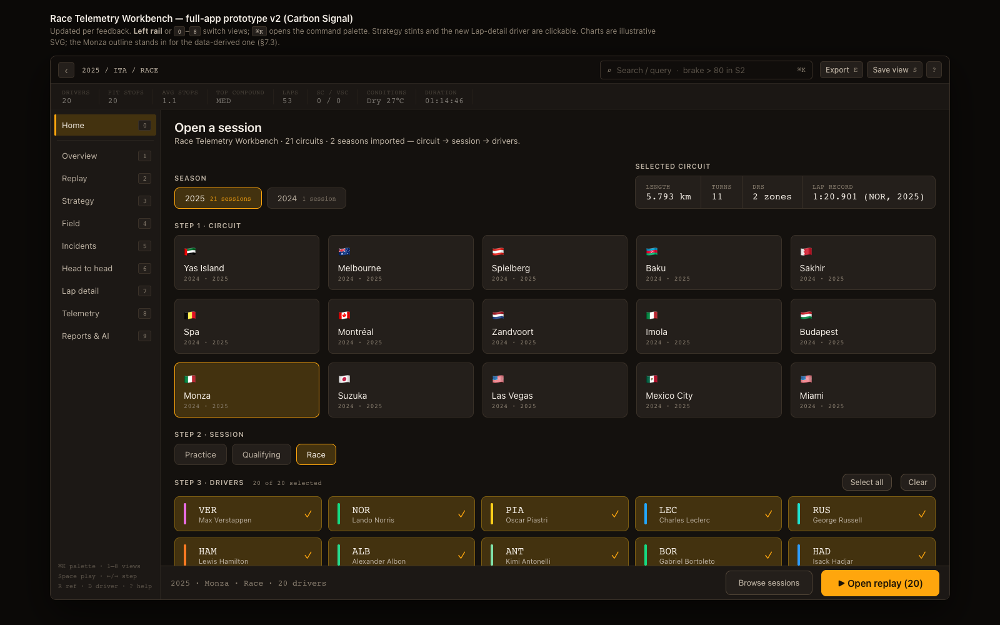

*Home: select a circuit, season, session, and driver field before opening the
workspace. The circuit preview, metadata, and driver selection all live inside
the same shell used by the analysis views.*

Once a session is open, the prototype exposes seven analysis surfaces without
losing session context.

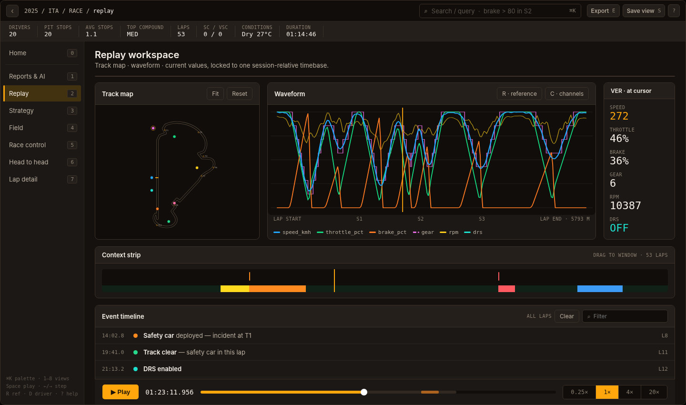

*Replay: a data-derived Monza track map, synchronized telemetry waveform, live
channel readout, context strip, event timeline, and playback transport, all
locked to one session-relative timebase.*

The current prototype contains eight views:

| Key | View | What it shows |
|---:|---|---|
| `0` | **Home** | Circuit → season → session → driver selection and session launcher |
| `1` | **Reports & AI** | Exportable race summary and MCP-backed assistant grounded in session data |
| `2` | **Replay** | Track map, telemetry waveform, live values, context strip, events, and transport |
| `3` | **Strategy** | Per-driver tyre stints, selectable stint detail, pit boundaries, and strategy narrative |
| `4` | **Field** | Sortable and filterable timing tower with Tower, Grid, and Gaps presentations |
| `5` | **Race control** | Flags and incidents on the circuit, synchronized race-control log, and assistant explanation |
| `6` | **Head to head** | Lap, corner, and cross-season comparison with linked telemetry and delta cursor |
| `7` | **Lap detail** | Full lap-by-lap driver log with sectors, tyres, speed traps, and channel summaries |

### Current Prototype Views

| | |
|---|---|
| 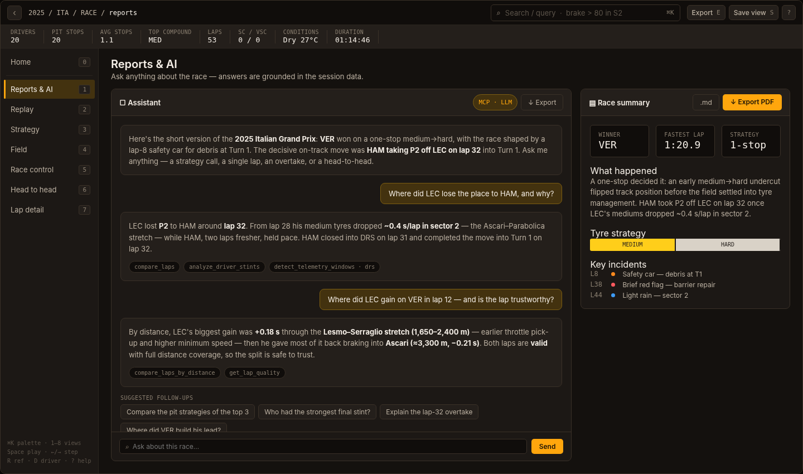 **Reports & AI** — a one-page race summary beside the MCP-backed assistant, including grounded tool traces and export actions. | 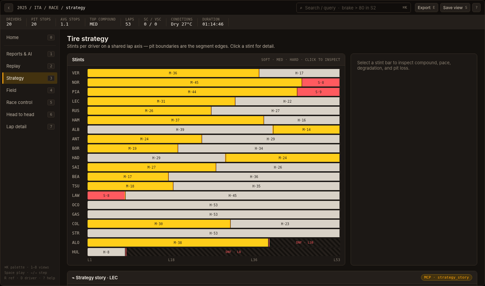 **Strategy** — every driver's stint sequence on a shared lap axis; stints are clickable and expose degradation and pit-stop detail. |
| 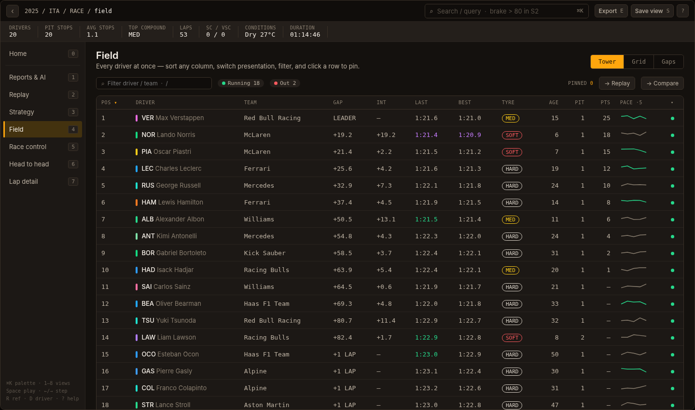 **Field** — sortable, filterable whole-field timing with selectable Tower, Grid, and Gaps modes and driver pinning. | 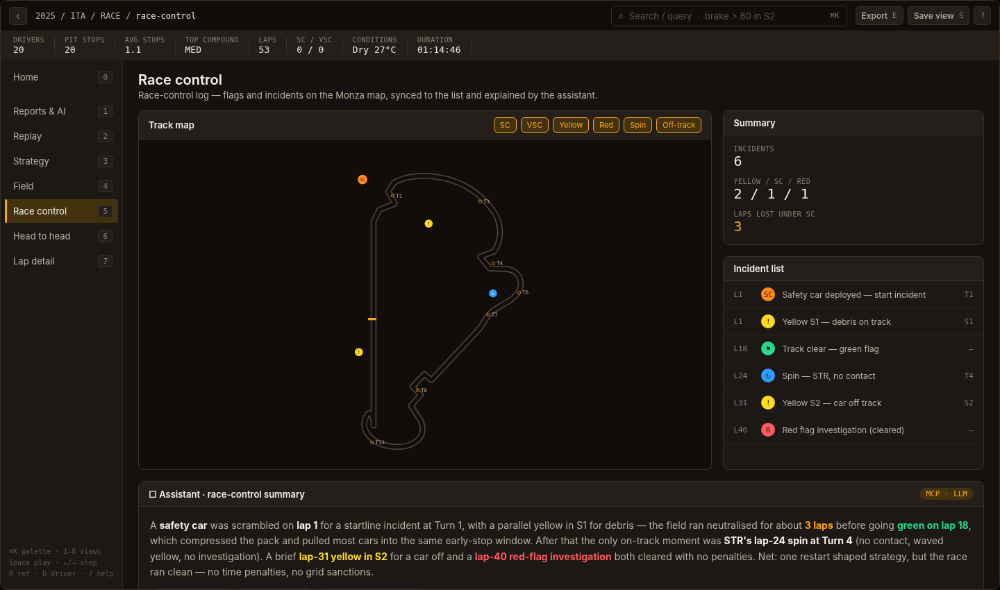 **Race control** — circuit markers and a synchronized race-control log for flags, incidents, weather, and session events. |
| 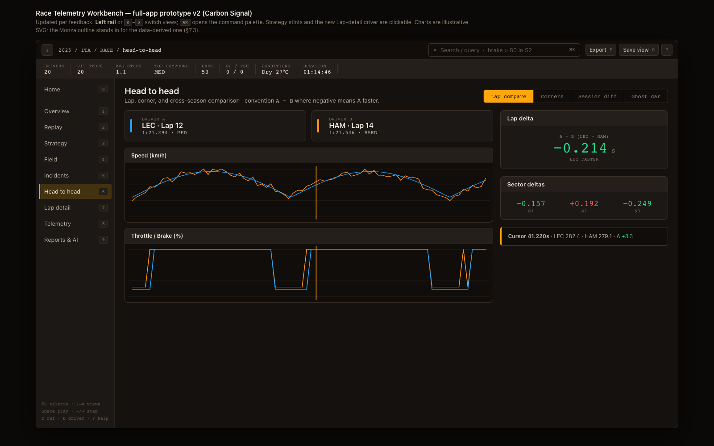 **Head to head** — linked lap telemetry, cumulative delta, circuit cursor, corner analysis, and cross-season comparison. | 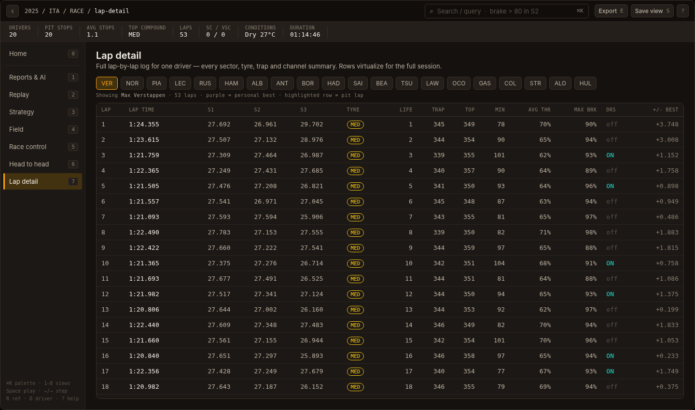 **Lap detail** — a dense driver-specific lap table with sectors, compounds, traps, validity, and telemetry summaries. |

**Explore the design now:**

- Interactive clickable prototype — [`docs/design-system/mockups/app-prototype.html`](docs/design-system/mockups/app-prototype.html) (open in a browser; use the rail or keys `0`–`7`, and `⌘K`)
- Design system — [`docs/design-system/DESIGN_SYSTEM.md`](docs/design-system/DESIGN_SYSTEM.md)
- Live styleguide and tokens — [`docs/design-system/styleguide.html`](docs/design-system/styleguide.html)

The backend below is intended to power these surfaces. Each view should consume
bounded Query API contracts, while the Reports & AI assistant obtains telemetry
through the same MCP tools available to external clients.

## AI-First Analysis Primitives

AI is a first-class analysis surface in Race Telemetry Workbench, not a sidecar
chat box. The app is designed so an engineer can inspect telemetry visually,
then ask natural-language questions against the same bounded data primitives
that drive the replay, strategy, race-control, comparison, and report views.

The Query API and MCP server expose compact analytical primitives so AI clients
do not need to download full race telemetry for every question. Each primitive is
grounded in shared contracts and PostgreSQL queries, which keeps answers tied to
the imported session data instead of free-form model guesses.

| Primitive | What it gives the AI/app |
|---|---|
| `aggregate_telemetry` | Grouped metrics such as DRS active time, brake time, average speed, max speed, sample count, and throttle-lift count |
| `detect_telemetry_windows` | Compact intervals for DRS activation, hard braking, throttle lifts, and high-speed periods |
| `analyze_driver_stints` | Tyre degradation, stint lap-time slope, best/worst lap, tyre-life range, and compound strategy summaries |
| `analyze_pit_stops` | Pit-in/out markers, nearby non-pit baselines, and estimated pit-lap loss |
| `get_weather_trend` | Weather deltas and rainfall summary for a session or selected time window |
| `get_race_control_timeline` | Searchable race-control timeline with category, flag, and status counts |
| `get_circuit_context` | Imported circuit rotation, corner markers, marshal lights, and marshal sectors |

These primitives are exposed over MCP and consumed by a **server-side agent**
(`RaceTelemetry.AgentApi`) rather than an in-process model call inside the
desktop app. The desktop sends the engineer's question together with the current
UI selection (session key, selected drivers, lap, active view) to the Agent API
over the AG-UI protocol; the server-side agent calls the MCP tools on the
engineer's behalf and streams the answer back as SSE. The OpenAI API key never
touches the desktop process.

The two roles are distinct:

- **Desktop → Agent API (UI selection state):** which session is open, which
  drivers are selected, which lap and view. Used as natural-language context for
  the model, not as telemetry data.
- **Agent → MCP (actual telemetry):** lap times, sector splits, telemetry
  samples, incidents, pit stops, weather — all fetched live from TimescaleDB via
  MCP tool calls, grounded in the same query store used by every other view.

## Backend Architecture

Race Telemetry Workbench uses **.NET Aspire** for the local backend loop. Aspire
starts and coordinates the Query API and MCP server, owns their stable public
ports, injects OpenTelemetry export settings, and gives the project a local
dashboard for logs, metrics, and distributed traces. TimescaleDB currently runs
from `docker-compose.yml`; the .NET services connect to it through the shared
`RACE_TELEMETRY_DATABASE_URL` setting and still emit PostgreSQL spans into the
Aspire Dashboard.

### System Interaction

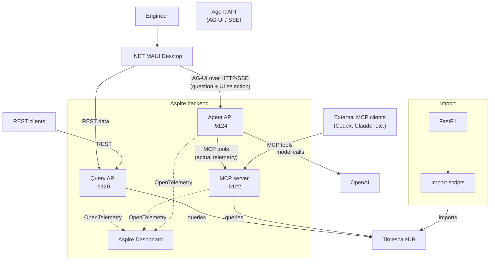

**Data flow for a chat question:**

1. Engineer types a question in the Reports & AI view
2. Desktop sends the question + current UI selection (session, drivers, lap) to `/ag-ui`
3. Agent API prepends the selection as context text and calls OpenAI
4. Model requests MCP tool calls (e.g. `compare_laps`, `aggregate_telemetry`)
5. Agent API executes each tool via the MCP server, which queries TimescaleDB
6. Model receives tool results and produces a grounded answer
7. Answer streams back to the desktop as AG-UI SSE events

### Aspire Observability

The Aspire Dashboard provides a single local view of the running backend topology
and its end-to-end traces. The resource graph shows the Query API, Agent API, MCP
server, and the OpenAI configuration injected into the agent process.

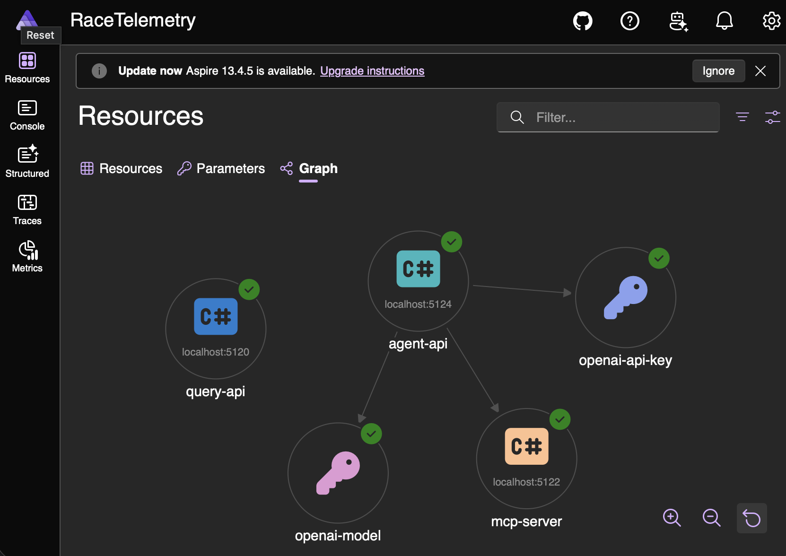

A real POST /ag-ui trace follows the complete agentic request. The Agent API
calls OpenAI, executes get_race_story through the MCP server, queries
TimescaleDB through the shared query store, and then calls the model again to
produce the final streamed answer.

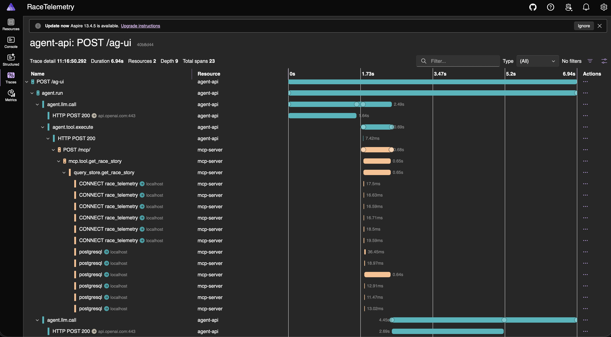

The trace below was produced by asking **“Compare the pit strategies of the top
3.”** The first model call resolves the analysis plan, after which the agent
executes `analyze_driver_stints` three times through MCP for each of the
top-three finishers. Each tool call is visible through the MCP server, shared
query store, and PostgreSQL spans before a final OpenAI call synthesizes the
comparison.

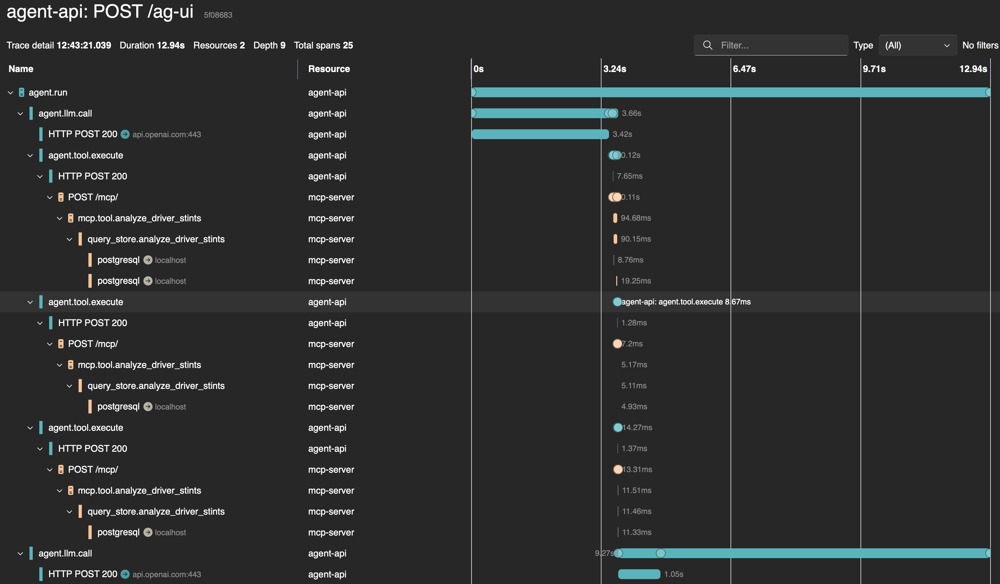

## Backend Deep Dive

### Aspire AppHost And Service Defaults

`src/RaceTelemetry.AppHost/` is the local distributed application entrypoint. It
declares the `query-api` and `mcp-server` project resources, injects the database
URL, and exposes stable HTTP ports:

| Resource | Stable URL | Role |
|---|---|---|
| `query-api` | `http://127.0.0.1:5120` | REST surface for replay, analysis, stories, and desktop clients |
| `mcp-server` | `http://127.0.0.1:5122/mcp` | Streamable HTTP MCP surface for coding-agent and assistant clients |
| `agent-api` | `http://127.0.0.1:5124` | AG-UI agent endpoint — receives questions from the desktop, calls OpenAI and MCP tools, streams answers |

`src/RaceTelemetry.ServiceDefaults/` wires common .NET service behavior:
OpenTelemetry tracing and metrics, health checks, service discovery defaults,
HTTP resilience, Npgsql instrumentation, and OTLP export to the Aspire
Dashboard. The custom activity sources `RaceTelemetry.Data` and
`RaceTelemetry.McpServer` make data-store operations and MCP tool calls visible
beside normal ASP.NET and PostgreSQL spans.

### FastF1 Import Pipeline

The Python scripts in `scripts/` are the only layer that reads from FastF1. The
import path downloads or reuses local FastF1 cache data, normalizes the session,
and loads it into PostgreSQL / TimescaleDB. Race sessions (`R`) are the default;
practice, qualifying, sprint qualifying, and sprint sessions are explicit
opt-ins.

Imported race context includes:

- sessions, drivers, laps, stint metadata, tyre compound, tyre life, pit-in, and
  pit-out flags
- raw car telemetry from `session.car_data`
- raw position samples from `session.pos_data`
- weather samples
- circuit rotation plus corner, marshal-light, and marshal-sector markers
- track status, session status, and race-control messages

### TimescaleDB Storage

The schema uses ordinary PostgreSQL tables for bounded metadata and TimescaleDB
hypertables for high-volume samples:

| Shape | Examples | Why |
|---|---|---|
| Relational tables | `sessions`, `session_drivers`, `laps`, `race_control_messages`, `circuit_markers` | Stable metadata and event facts |
| Hypertables | `telemetry_samples`, `position_samples`, `weather_samples` | Time-windowed replay and analysis data |
| Views | `driver_stint_summaries`, `track_status_periods`, `session_weather_summary`, `race_control_event_index`, `telemetry_event_candidates` | Compact analytical surfaces for API and MCP clients |

The database preserves backend `NULL` values instead of inventing client-friendly
defaults. Track outlines and replay positions are derived from imported
`position_samples`, not static circuit artwork.

#### Compression Experiment

A local Timescale compression experiment showed that column-oriented compression
is promising for storage but not yet an obvious default for replay hot paths.

| Data | Before | After | Reduction |
|---|---:|---:|---:|
| Raw telemetry + position | ~12 GB | ~279 MB | ~42.7x |
| `aligned_telemetry_10hz` | 15 GB | 1,505 MB | ~10.3x |

The tradeoff was query latency. Hot-cache, replay-shaped reads generally slowed
down because decompression added CPU overhead: for example, a 5-second
all-driver aligned query moved from `3.57 ms` to `7.19 ms`, and a lap-25
all-driver aligned query moved from `39.45 ms` to `67.01 ms`.

Decision: keep compression out of the default migrations for now. Revisit after
larger-dataset and cold-cache testing, plus chunk/columnstore tuning shaped
specifically around replay queries.

### Shared Data Layer

`src/RaceTelemetry.Data/` owns the `IF1TelemetryQueryStore` abstraction and the
PostgreSQL implementation. The Query API and MCP server both call this layer
instead of duplicating SQL.

The data layer keeps hot paths bounded by explicit session IDs, time ranges,
channels, sampling intervals, and row limits. It also emits custom spans such as
`query_store.get_sessions`, `query_store.get_replay_metadata`, and
`query_store.aggregate_telemetry`, which makes backend work visible in Aspire
traces between the HTTP/MCP entrypoint and the Npgsql spans.

### Query API

`src/RaceTelemetry.QueryApi/` is an ASP.NET Core Minimal API. Route registration
and handlers live in `RaceTelemetryApi.cs`, while validation and problem
responses live in `RaceTelemetryApi.Validation.cs`.

The API exposes bounded routes for:

- sessions, drivers, laps, standings, positions, and incidents
- lap telemetry with sampling and row limits
- replay metadata, replay chunks, and replay context windows
- lap comparison, lap stories, braking zones, and race stories
- telemetry event search
- telemetry aggregates, telemetry windows, stint analysis, pit-stop analysis,
  weather trends, race-control timelines, and circuit context

Errors use stable RFC-style problem responses with project-specific error codes,
and response DTOs come from `RaceTelemetry.Contracts`.

### MCP Server

`src/RaceTelemetry.McpServer/` exposes the same read-only analytical surface over
Streamable HTTP MCP. It is designed for assistant questions such as "What
happened in the Monza race?", "Compare Leclerc and Hamilton on lap 53.", and
"Where were the main braking zones?"

Each tool returns bounded structured content and uses the same query store as
the Query API. Tool calls emit spans such as `mcp.tool.list_sessions`,
`mcp.tool.get_race_story`, and `mcp.tool.aggregate_telemetry`, so Aspire can show
the MCP request, tool execution, shared data-layer call, and PostgreSQL query in
one trace.

### Agent Library And Agent API

`src/RaceTelemetry.Agent/` is a class library that owns the OpenAI client
construction, MCP tool discovery, and agent configuration. It exposes a
singleton `McpToolRegistry` that connects to the MCP server at startup, calls
`ListToolsAsync` once, and makes the discovered tools available to the chat
client as `AIFunction` instances.

`src/RaceTelemetry.AgentApi/` is an ASP.NET Core service that hosts the AG-UI
endpoint. It accepts chat runs from the desktop, resolves or creates an
in-memory session keyed by `threadId`, serialises concurrent turns on the same
thread, and drives a streaming agentic loop: model call → tool calls → model
call → final text. The answer is emitted as a sequence of AG-UI SSE events
(`RUN_STARTED`, `TOOL_CALL_START`, `TEXT_MESSAGE_CONTENT`, `RUN_FINISHED`, etc.).

Key design points:

- The OpenAI API key lives only in the Agent API process, injected by Aspire
  from user secrets. The desktop app has no key and no OpenAI dependency.
- Conversation state is in-memory per `threadId`. Sessions expire after one
  hour of inactivity; they are lost if the Agent API restarts (by design).
- The Agent API binds to loopback (`127.0.0.1:5124`) and has no authentication,
  appropriate for a local desktop tool.
- The desktop sends only the current UI selection (session key, drivers, lap,
  active view) as context — not raw telemetry. The agent fetches actual
  telemetry data via MCP tool calls.

### Contracts And Client Parity

`src/RaceTelemetry.Contracts/` is the shared DTO boundary for the API, MCP
server, and desktop app. Contract changes should be additive where possible, and
API/MCP behavior should stay in parity unless a divergence is intentionally
documented.

The Bruno collection in `bruno/race-telemetry-query-api` is the manual REST test
surface for the local Query API. It covers core session requests, replay
endpoints, event search, and story-oriented analytical responses.

The desktop app reads the Query API through the same contracts. That keeps the
future MAUI replay surface aligned with the API and with the MCP tools used by
assistant clients.

## Quick Start

Start TimescaleDB:

```bash
docker compose up -d timescaledb
```

Install Python dependencies:

```bash
python3 -m venv .venv
.venv/bin/python -m pip install -r scripts/requirements.txt
```

Download and import a small Monza slice:

```bash
.venv/bin/python scripts/download_session.py --year 2024 --event Monza --drivers LEC --limit-laps 3
.venv/bin/python scripts/import_session.py --year 2024 --event Monza --drivers LEC --limit-laps 1 --mode replace
```

Build .NET projects:

```bash
dotnet restore RaceTelemetryWorkbench.slnx
dotnet build RaceTelemetryWorkbench.slnx
```

Configure the OpenAI key (once, stored in user secrets):

```bash
dotnet user-secrets set "Parameters:openai-api-key" "sk-..." \
  --project src/RaceTelemetry.AppHost
dotnet user-secrets set "Parameters:openai-model" "gpt-4o" \
  --project src/RaceTelemetry.AppHost
```

Run with Aspire:

```bash
aspire start
```

Stable local ports:

| Resource | URL |
|---|---|
| Query API | `http://127.0.0.1:5120` |
| MCP server | `http://127.0.0.1:5122/mcp` |
| Agent API | `http://127.0.0.1:5124` |
| Aspire Dashboard | `https://127.0.0.1:18888` |

Verify agent readiness:

```bash
curl http://127.0.0.1:5124/health/ready
```

Open the Bruno collections:

```text
bruno/race-telemetry-query-api   # REST API testing
bruno/race-telemetry-agent-api   # AG-UI agent testing
```

## Example API Calls

```bash
curl http://127.0.0.1:5120/api/sessions
curl http://127.0.0.1:5120/api/sessions/2025-italian-grand-prix-r/replay/metadata
curl http://127.0.0.1:5120/api/sessions/2025-italian-grand-prix-r/story
curl http://127.0.0.1:5120/api/sessions/2025-italian-grand-prix-r/drivers/LEC/laps/53/story
curl http://127.0.0.1:5120/api/sessions/2025-italian-grand-prix-r/drivers/LEC/laps/53/braking-zones
```

Register the MCP server with Codex CLI:

```bash
codex mcp add race-telemetry-aspire --url http://127.0.0.1:5122/mcp
codex mcp list
```

## What Is Coming Next

The design system, view set, interactive prototype, and AI agent are complete.
The next evolution builds the remaining desktop surfaces on the existing API:

- focused real-database tests for analytical Query API endpoints
- the high-performance .NET MAUI session console and Replay workspace
- data-derived track map and driver replay
- timeline overlays for weather, flags, safety car, VSC, and race control
- lap comparison, strategy, field, and incident views

## Repository Map

| Path | Purpose |
|---|---|
| `scripts/` | FastF1 download, import, bulk import, and storage estimate scripts |
| `db/migrations/` | PostgreSQL / TimescaleDB schema, hypertables, indexes, and views |
| `src/RaceTelemetry.Agent/` | Agent class library — OpenAI client, MCP tool discovery, agent configuration |
| `src/RaceTelemetry.AgentApi/` | AG-UI agent endpoint — session registry, SSE streaming, loopback-only |
| `src/RaceTelemetry.QueryApi/` | ASP.NET Core Query API |
| `src/RaceTelemetry.McpServer/` | HTTP MCP server |
| `src/RaceTelemetry.Data/` | Query-store abstraction and PostgreSQL implementation |
| `src/RaceTelemetry.Contracts/` | Shared API/MCP/Desktop DTOs |
| `src/RaceTelemetry.AppHost/` | Aspire AppHost |
| `src/RaceTelemetry.Desktop/` | .NET MAUI desktop app |
| `bruno/race-telemetry-query-api/` | Bruno collection for Query API manual testing |
| `bruno/race-telemetry-agent-api/` | Bruno collection for Agent API / AG-UI manual testing |
| `tests/RaceTelemetry.AgentApi.Tests/` | Session registry unit tests |
| `docs/` | Development, data, API/MCP, and OpenAPI docs |
| `docs/design-system/` | Carbon Signal design system, tokens, styleguide, and the interactive app prototype |
| `docs/images/` | Rendered mockups used in documentation |
| `planning.md` | Backlog, decisions, and progress tracking |

## License

GNU GPLv3. See `LICENSE`.
