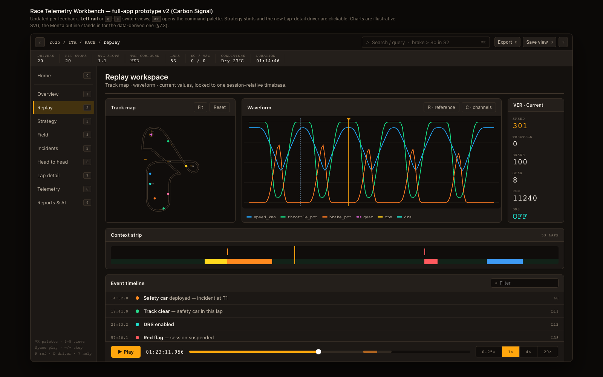
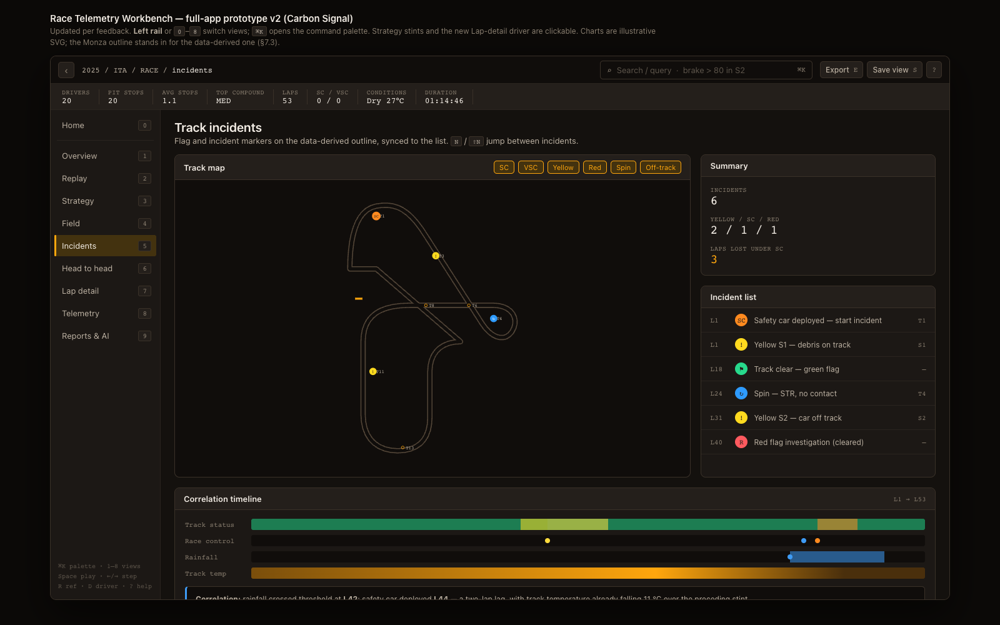

# Race Telemetry Workbench

Race Telemetry Workbench is a local Formula 1 telemetry analysis project. It
imports public FastF1 race data into TimescaleDB, exposes the data through a
.NET Query API and HTTP MCP server, and is evolving toward a desktop replay and
natural-language race analysis workbench.

The project is built around one goal: turn raw race telemetry into useful
engineering and race-strategy insight without requiring every user to write SQL
or manually inspect thousands of samples.

## What It Will Look Like

The end state is a high-performance .NET MAUI **desktop workbench** for race
engineers — keyboard-first, information-dense, and built on a project-owned
design system called **Carbon Signal**.

Rather than a generic dashboard with horizontal tabs, the app is a **session
console** with three persistent regions that never lose context: a monospace
command bar (breadcrumb + always-on query input), an instrument **HUD** strip of
session metrics, and a left **view rail** switched by number keys `0`–`9`. A
single signal-amber accent is reserved for action, selection, focus, and the
replay cursor; an original, colorblind-safe palette carries the telemetry
channels so data never competes with chrome.


*Home: the entry point into the console. A circuit → season → session funnel on
the left, a live preview of the selected circuit (length, turns, DRS zones, lap
record) on the right, and a driver grid to pick the field before opening a replay
— all inside the same command bar / HUD / rail shell used by every other view.*

Once a session is open, the same shell carries you through ten purpose-built
surfaces — from second-by-second replay to strategy, timing, incidents, lap
comparison, and an AI-assisted race story.



*Replay: a data-derived Monza track map, a synchronized telemetry waveform with a
primary (amber) and reference (cool) cursor, a live current-values readout, the
seekable context strip, an event timeline of race-control messages (safety car,
track clear, DRS, red flag), and the playback transport — all locked to one
session-relative timebase.*

The workbench is organized into ten surfaces:

| View | What it shows |
|---|---|
| **Home** | Circuit → session → driver funnel to open a session |
| **Overview** | Result cards, full classification, stint sequence, positions gained |
| **Replay** | Track map, telemetry waveform, current values, context strip, transport |
| **Strategy** | Tyre-stint gantt, pit-loss narrative, degradation & pit-window predictor |
| **Field** | Sortable, filterable timing tower with pace sparklines (Tower / Grid / Gaps) |
| **Incidents** | Flag and incident markers on the track outline + incident × weather correlation |
| **Head to head** | Lap comparison, corner-level index, multi-season diff, ghost-car overlay |
| **Lap detail** | Full lap-by-lap log for one driver — every sector, tyre, trap, and channel |
| **Telemetry** | Bounded-aggregate explorer: histograms and load maps |
| **Reports & AI** | One-page race debrief / session report export and the MCP race-story assistant |

### More Views

| | |
|---|---|
|  **Strategy** — per-driver stint gantt on a shared lap axis, with an MCP-generated strategy story (undercut/overcut narrative) underneath. |  **Incidents** — flag and incident markers on the data-derived track outline, correlated against track status, race control, rainfall, and track temperature. |
|  **Head to head** — lap-relative speed and throttle/brake overlays for two drivers, with lap delta and sector-by-sector deltas. |  **Reports & AI** — the MCP-backed race-story assistant: ask a question in plain language and get an answer grounded in the same `list_drivers` / `compare_laps` / `aggregate_telemetry` / `analyze_driver_stints` tools exposed to MCP clients. |

**Explore the design now:**

- Interactive clickable prototype — [`docs/design-system/mockups/app-prototype.html`](docs/design-system/mockups/app-prototype.html) (open in a browser; use the rail or keys `0`–`9`, and `⌘K`)
- Design system — [`docs/design-system/DESIGN_SYSTEM.md`](docs/design-system/DESIGN_SYSTEM.md)
- Live styleguide and tokens — [`docs/design-system/styleguide.html`](docs/design-system/styleguide.html)

The backend below already powers this design: every view maps to a bounded Query
API route and an MCP tool, so the desktop UI reads from the same contracts as any
other client.

## What It Does Today

### Import Full Race Context

The Python importer can load race sessions from FastF1 into PostgreSQL /
TimescaleDB:

- sessions, drivers, and laps
- raw car telemetry: speed, throttle, brake, gear, RPM, DRS
- raw position samples for replay and track maps
- tyre compound, tyre life, stint, pit-in, and pit-out lap metadata
- weather samples
- circuit metadata and corner/marshal markers
- track status, session status, and race-control messages

Race sessions (`R`) are the default. Practice, qualifying, sprint qualifying,
and sprint sessions are explicit opt-ins.

### Store Data For Replay And Analysis

The database schema combines ordinary PostgreSQL tables with TimescaleDB
hypertables. It also includes analytical views for common questions:

- lap summaries
- stint summaries
- weather summaries
- track-status periods
- race-control search
- telemetry event candidates

This keeps high-volume samples queryable while giving API and MCP clients compact
summary surfaces.

### Query API

The .NET Query API exposes bounded REST endpoints for:

- listing sessions, drivers, and laps
- fetching lap telemetry with sampling and row limits
- comparing two laps by lap-relative time buckets
- replay metadata, replay chunks, and replay context
- searching telemetry event candidates
- race story, lap story, braking zones, and lap comparison story responses

The API uses shared contracts from `RaceTelemetry.Contracts` and a
Timescale-backed query store in `RaceTelemetry.Data`.

### MCP Server

The MCP server exposes read-only Streamable HTTP tools for Codex, Claude, and
other MCP-compatible clients. It is designed for natural-language questions such
as:

- "What happened in the Monza race?"
- "Compare Leclerc and Hamilton on lap 53."
- "Where were the main braking zones?"
- "What context should I know before replaying this stint?"

Current MCP tools return bounded JSON and reuse the same query-store contracts
as the Query API.

### Bruno Collection

The Bruno collection under `bruno/race-telemetry-query-api` is ready for manual
testing against the local Query API. It includes requests for the core API,
replay endpoints, event search, and story-oriented analytical responses.

## Current Architecture

```text
FastF1
  |
  v
Python import scripts
  |
  v
TimescaleDB / PostgreSQL
  |
  v
.NET Query API  <---- Bruno / MAUI desktop app
  |
  v
HTTP MCP Server <---- Codex / Claude / MCP clients
```

The desktop app project slot exists and is fully designed (see
[What It Will Look Like](#what-it-will-look-like) and the interactive prototype);
the .NET MAUI UI implementation is in progress.

## Quick Start

Start TimescaleDB:

```bash
docker compose up -d timescaledb
```

Install Python dependencies:

```bash
python3 -m venv .venv
.venv/bin/python -m pip install -r scripts/requirements.txt
```

Download and import a small Monza slice:

```bash
.venv/bin/python scripts/download_session.py --year 2024 --event Monza --drivers LEC --limit-laps 3
.venv/bin/python scripts/import_session.py --year 2024 --event Monza --drivers LEC --limit-laps 1 --mode replace
```

Build .NET projects:

```bash
dotnet restore RaceTelemetryWorkbench.slnx
dotnet build RaceTelemetryWorkbench.slnx
```

Run with Aspire:

```bash
aspire start
```

Stable local ports:

| Resource | URL |
|---|---|
| Query API | `http://127.0.0.1:5120` |
| MCP server | `http://127.0.0.1:5122/mcp` |
| Aspire Dashboard | `https://127.0.0.1:18888` |

Open the Bruno collection:

```text
bruno/race-telemetry-query-api
```

## Example API Calls

```bash
curl http://127.0.0.1:5120/api/sessions
curl http://127.0.0.1:5120/api/sessions/2025-italian-grand-prix-r/replay/metadata
curl http://127.0.0.1:5120/api/sessions/2025-italian-grand-prix-r/story
curl http://127.0.0.1:5120/api/sessions/2025-italian-grand-prix-r/drivers/LEC/laps/53/story
curl http://127.0.0.1:5120/api/sessions/2025-italian-grand-prix-r/drivers/LEC/laps/53/braking-zones
```

Register the MCP server with Codex CLI:

```bash
codex mcp add race-telemetry-aspire --url http://127.0.0.1:5122/mcp
codex mcp list
```

## Natural-Language Analysis Primitives

The Query API and MCP server include compact analytical primitives so complex
questions do not require the MCP client to download all telemetry samples for a
driver or race.

- `aggregate_telemetry`
  - grouped metrics such as DRS active time, brake time, average speed, max
    speed, sample count, and throttle-lift count
- `detect_telemetry_windows`
  - compact intervals for DRS activation, hard braking, throttle lifts, and
    high-speed periods
- `analyze_driver_stints`
  - tyre degradation, stint lap-time slope, best/worst lap, tyre-life range,
    and compound strategy summaries
- `analyze_pit_stops`
  - pit-in/out markers, nearby non-pit baselines, and estimated pit-lap loss
- `get_weather_trend`
  - weather deltas and rainfall summary for a session or selected time window
- `get_race_control_timeline`
  - searchable race-control timeline with category, flag, and status counts
- `get_circuit_context`
  - imported circuit rotation, corner markers, marshal lights, and marshal
    sectors

The Query API and MCP server stay in sync: every analytical MCP tool is backed
by a shared contract and Query API route.

## What Is Coming Next

The design system, view set, and interactive prototype are complete (see
[What It Will Look Like](#what-it-will-look-like)). The next evolution builds that
design on the existing API:

- focused real-database tests for analytical Query API endpoints
- the high-performance .NET MAUI session console and Replay workspace
- data-derived track map and driver replay
- timeline overlays for weather, flags, safety car, VSC, and race control
- lap comparison, strategy, field, and incident views
- the MCP-backed race-story assistant beside the race data

## Repository Map

| Path | Purpose |
|---|---|
| `scripts/` | FastF1 download, import, bulk import, and storage estimate scripts |
| `db/migrations/` | PostgreSQL / TimescaleDB schema, hypertables, indexes, and views |
| `src/RaceTelemetry.QueryApi/` | ASP.NET Core Query API |
| `src/RaceTelemetry.McpServer/` | HTTP MCP server |
| `src/RaceTelemetry.Data/` | Query-store abstraction and PostgreSQL implementation |
| `src/RaceTelemetry.Contracts/` | Shared API/MCP/Desktop DTOs |
| `src/RaceTelemetry.AppHost/` | Aspire AppHost |
| `bruno/race-telemetry-query-api/` | Bruno collection for manual API testing |
| `docs/` | Development, data, API/MCP, and OpenAPI docs |
| `docs/design-system/` | Carbon Signal design system, tokens, styleguide, and the interactive app prototype |
| `docs/images/` | Rendered mockups used in documentation |
| `planning.md` | Backlog, decisions, and progress tracking |

## License

GNU GPLv3. See `LICENSE`.
