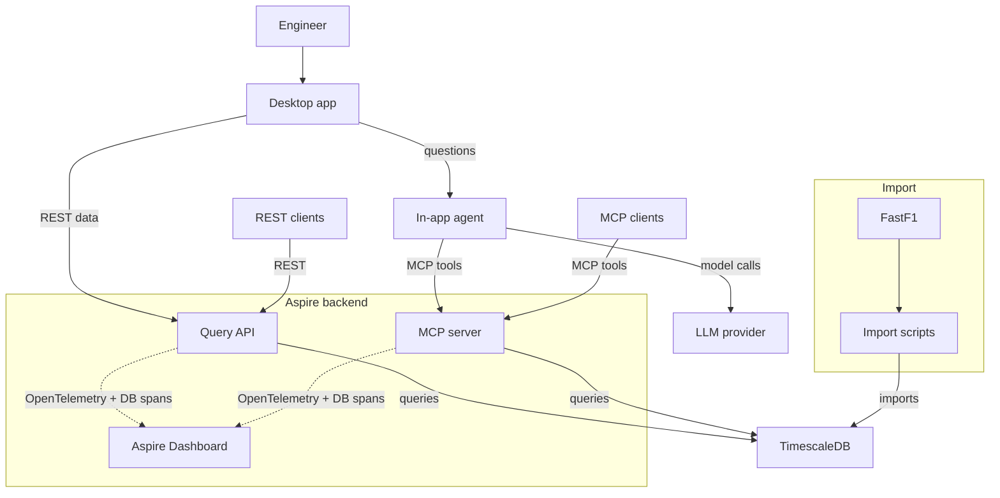
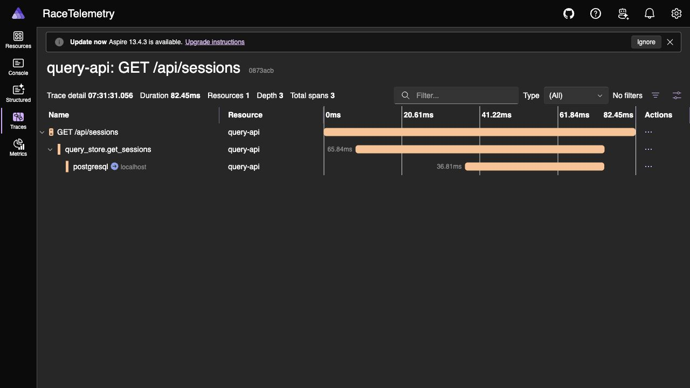
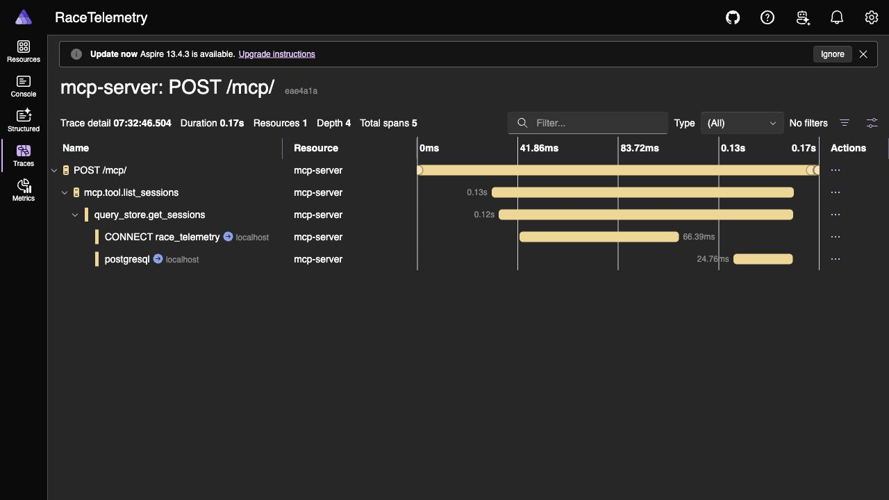

# Race Telemetry Workbench

Race Telemetry Workbench is a local Formula 1 telemetry analysis project. It
imports public FastF1 race data into TimescaleDB, exposes the data through a
.NET Query API and HTTP MCP server, and is evolving toward a desktop replay and
natural-language race analysis workbench.

The project is built around one goal: turn raw race telemetry into useful
engineering and race-strategy insight without requiring every user to write SQL
or manually inspect thousands of samples.

## What It Will Look Like

The end state is a high-performance .NET MAUI **desktop workbench** for race
engineers — keyboard-first, information-dense, and built on a project-owned
design system called **Carbon Signal**.

Rather than a generic dashboard with horizontal tabs, the app is a **session
console** with three persistent regions that never lose context: a monospace
command bar (breadcrumb + always-on query input), an instrument **HUD** strip of
session metrics, and a left **view rail** switched by number keys `0`–`9`. A
single signal-amber accent is reserved for action, selection, focus, and the
replay cursor; an original, colorblind-safe palette carries the telemetry
channels so data never competes with chrome.


*Home: the entry point into the console. A circuit → season → session funnel on
the left, a live preview of the selected circuit (length, turns, DRS zones, lap
record) on the right, and a driver grid to pick the field before opening a replay
— all inside the same command bar / HUD / rail shell used by every other view.*

Once a session is open, the same shell carries you through ten purpose-built
surfaces — from second-by-second replay to strategy, timing, incidents, lap
comparison, and an AI-assisted race story.


*Replay: a data-derived Monza track map, a synchronized telemetry waveform with a
primary (amber) and reference (cool) cursor, a live current-values readout, the
seekable context strip, an event timeline of race-control messages (safety car,
track clear, DRS, red flag), and the playback transport — all locked to one
session-relative timebase.*

The workbench is organized into ten surfaces:

| View | What it shows |
|---|---|
| **Home** | Circuit → session → driver funnel to open a session |
| **Overview** | Result cards, full classification, stint sequence, positions gained |
| **Replay** | Track map, telemetry waveform, current values, context strip, transport |
| **Strategy** | Tyre-stint gantt, pit-loss narrative, degradation & pit-window predictor |
| **Field** | Sortable, filterable timing tower with pace sparklines (Tower / Grid / Gaps) |
| **Incidents** | Flag and incident markers on the track outline + incident × weather correlation |
| **Head to head** | Lap comparison, corner-level index, multi-season diff, ghost-car overlay |
| **Lap detail** | Full lap-by-lap log for one driver — every sector, tyre, trap, and channel |
| **Telemetry** | Bounded-aggregate explorer: histograms and load maps |
| **Reports & AI** | One-page race debrief / session report export and the MCP race-story assistant |

### More Views

| | |
|---|---|
|  **Strategy** — per-driver stint gantt on a shared lap axis, with an MCP-generated strategy story (undercut/overcut narrative) underneath. |  **Incidents** — flag and incident markers on the data-derived track outline, correlated against track status, race control, rainfall, and track temperature. |
|  **Head to head** — lap-relative speed and throttle/brake overlays for two drivers, with lap delta and sector-by-sector deltas. |  **Reports & AI** — the MCP-backed race-story assistant: ask a question in plain language and get an answer grounded in the same `list_drivers` / `compare_laps` / `aggregate_telemetry` / `analyze_driver_stints` tools exposed to MCP clients. |

**Explore the design now:**

- Interactive clickable prototype — [`docs/design-system/mockups/app-prototype.html`](docs/design-system/mockups/app-prototype.html) (open in a browser; use the rail or keys `0`–`9`, and `⌘K`)
- Design system — [`docs/design-system/DESIGN_SYSTEM.md`](docs/design-system/DESIGN_SYSTEM.md)
- Live styleguide and tokens — [`docs/design-system/styleguide.html`](docs/design-system/styleguide.html)

The backend below already powers this design: every view maps to a bounded Query
API route and an MCP tool, so the desktop UI reads from the same contracts as any
other client.

## AI-First Analysis Primitives

AI is a first-class analysis surface in Race Telemetry Workbench, not a sidecar
chat box. The app is designed so an engineer can inspect telemetry visually,
then ask natural-language questions against the same bounded data primitives
that drive the replay, strategy, incidents, comparison, and report views.

The Query API and MCP server expose compact analytical primitives so AI clients
do not need to download full race telemetry for every question. Each primitive is
grounded in shared contracts and PostgreSQL queries, which keeps answers tied to
the imported session data instead of free-form model guesses.

| Primitive | What it gives the AI/app |
|---|---|
| `aggregate_telemetry` | Grouped metrics such as DRS active time, brake time, average speed, max speed, sample count, and throttle-lift count |
| `detect_telemetry_windows` | Compact intervals for DRS activation, hard braking, throttle lifts, and high-speed periods |
| `analyze_driver_stints` | Tyre degradation, stint lap-time slope, best/worst lap, tyre-life range, and compound strategy summaries |
| `analyze_pit_stops` | Pit-in/out markers, nearby non-pit baselines, and estimated pit-lap loss |
| `get_weather_trend` | Weather deltas and rainfall summary for a session or selected time window |
| `get_race_control_timeline` | Searchable race-control timeline with category, flag, and status counts |
| `get_circuit_context` | Imported circuit rotation, corner markers, marshal lights, and marshal sectors |

These primitives are the bridge between the desktop workbench and the AI layer:
the Query API serves deterministic UI views, while MCP exposes the same
analytical surface to the app's small in-process agent and to external clients
such as Codex or Claude. The Reports & AI view is built around this model: bring
your own model API key, ask a question in plain language, get an answer grounded
in bounded telemetry, and jump back to the relevant session, lap, stint,
incident, or comparison context.

## Backend Architecture

Race Telemetry Workbench uses **.NET Aspire** for the local backend loop. Aspire
starts and coordinates the Query API and MCP server, owns their stable public
ports, injects OpenTelemetry export settings, and gives the project a local
dashboard for logs, metrics, and distributed traces. TimescaleDB currently runs
from `docker-compose.yml`; the .NET services connect to it through the shared
`RACE_TELEMETRY_DATABASE_URL` setting and still emit PostgreSQL spans into the
Aspire Dashboard.

### System Interaction



### Aspire Observability

The screenshots below were captured from the local Aspire Dashboard after a real
REST query and a real MCP tool call. They show the backend entrypoints, shared
query-store spans, and PostgreSQL work in one trace waterfall.





## Backend Deep Dive

### Aspire AppHost And Service Defaults

`src/RaceTelemetry.AppHost/` is the local distributed application entrypoint. It
declares the `query-api` and `mcp-server` project resources, injects the database
URL, and exposes stable HTTP ports:

| Resource | Stable URL | Role |
|---|---|---|
| `query-api` | `http://127.0.0.1:5120` | REST surface for replay, analysis, stories, and desktop clients |
| `mcp-server` | `http://127.0.0.1:5122/mcp` | Streamable HTTP MCP surface for coding-agent and assistant clients |

`src/RaceTelemetry.ServiceDefaults/` wires common .NET service behavior:
OpenTelemetry tracing and metrics, health checks, service discovery defaults,
HTTP resilience, Npgsql instrumentation, and OTLP export to the Aspire
Dashboard. The custom activity sources `RaceTelemetry.Data` and
`RaceTelemetry.McpServer` make data-store operations and MCP tool calls visible
beside normal ASP.NET and PostgreSQL spans.

### FastF1 Import Pipeline

The Python scripts in `scripts/` are the only layer that reads from FastF1. The
import path downloads or reuses local FastF1 cache data, normalizes the session,
and loads it into PostgreSQL / TimescaleDB. Race sessions (`R`) are the default;
practice, qualifying, sprint qualifying, and sprint sessions are explicit
opt-ins.

Imported race context includes:

- sessions, drivers, laps, stint metadata, tyre compound, tyre life, pit-in, and
  pit-out flags
- raw car telemetry from `session.car_data`
- raw position samples from `session.pos_data`
- weather samples
- circuit rotation plus corner, marshal-light, and marshal-sector markers
- track status, session status, and race-control messages

### TimescaleDB Storage

The schema uses ordinary PostgreSQL tables for bounded metadata and TimescaleDB
hypertables for high-volume samples:

| Shape | Examples | Why |
|---|---|---|
| Relational tables | `sessions`, `session_drivers`, `laps`, `race_control_messages`, `circuit_markers` | Stable metadata and event facts |
| Hypertables | `telemetry_samples`, `position_samples`, `weather_samples` | Time-windowed replay and analysis data |
| Views | `driver_stint_summaries`, `track_status_periods`, `session_weather_summary`, `race_control_event_index`, `telemetry_event_candidates` | Compact analytical surfaces for API and MCP clients |

The database preserves backend `NULL` values instead of inventing client-friendly
defaults. Track outlines and replay positions are derived from imported
`position_samples`, not static circuit artwork.

#### Compression Experiment

A local Timescale compression experiment showed that column-oriented compression
is promising for storage but not yet an obvious default for replay hot paths.

| Data | Before | After | Reduction |
|---|---:|---:|---:|
| Raw telemetry + position | ~12 GB | ~279 MB | ~42.7x |
| `aligned_telemetry_10hz` | 15 GB | 1,505 MB | ~10.3x |

The tradeoff was query latency. Hot-cache, replay-shaped reads generally slowed
down because decompression added CPU overhead: for example, a 5-second
all-driver aligned query moved from `3.57 ms` to `7.19 ms`, and a lap-25
all-driver aligned query moved from `39.45 ms` to `67.01 ms`.

Decision: keep compression out of the default migrations for now. Revisit after
larger-dataset and cold-cache testing, plus chunk/columnstore tuning shaped
specifically around replay queries.

### Shared Data Layer

`src/RaceTelemetry.Data/` owns the `IF1TelemetryQueryStore` abstraction and the
PostgreSQL implementation. The Query API and MCP server both call this layer
instead of duplicating SQL.

The data layer keeps hot paths bounded by explicit session IDs, time ranges,
channels, sampling intervals, and row limits. It also emits custom spans such as
`query_store.get_sessions`, `query_store.get_replay_metadata`, and
`query_store.aggregate_telemetry`, which makes backend work visible in Aspire
traces between the HTTP/MCP entrypoint and the Npgsql spans.

### Query API

`src/RaceTelemetry.QueryApi/` is an ASP.NET Core Minimal API. Route registration
and handlers live in `RaceTelemetryApi.cs`, while validation and problem
responses live in `RaceTelemetryApi.Validation.cs`.

The API exposes bounded routes for:

- sessions, drivers, laps, standings, positions, and incidents
- lap telemetry with sampling and row limits
- replay metadata, replay chunks, and replay context windows
- lap comparison, lap stories, braking zones, and race stories
- telemetry event search
- telemetry aggregates, telemetry windows, stint analysis, pit-stop analysis,
  weather trends, race-control timelines, and circuit context

Errors use stable RFC-style problem responses with project-specific error codes,
and response DTOs come from `RaceTelemetry.Contracts`.

### MCP Server

`src/RaceTelemetry.McpServer/` exposes the same read-only analytical surface over
Streamable HTTP MCP. It is designed for assistant questions such as "What
happened in the Monza race?", "Compare Leclerc and Hamilton on lap 53.", and
"Where were the main braking zones?"

Each tool returns bounded structured content and uses the same query store as
the Query API. Tool calls emit spans such as `mcp.tool.list_sessions`,
`mcp.tool.get_race_story`, and `mcp.tool.aggregate_telemetry`, so Aspire can show
the MCP request, tool execution, shared data-layer call, and PostgreSQL query in
one trace.

### Contracts And Client Parity

`src/RaceTelemetry.Contracts/` is the shared DTO boundary for the API, MCP
server, and desktop app. Contract changes should be additive where possible, and
API/MCP behavior should stay in parity unless a divergence is intentionally
documented.

The Bruno collection in `bruno/race-telemetry-query-api` is the manual REST test
surface for the local Query API. It covers core session requests, replay
endpoints, event search, and story-oriented analytical responses.

The desktop app reads the Query API through the same contracts. That keeps the
future MAUI replay surface aligned with the API and with the MCP tools used by
assistant clients.

## Quick Start

Start TimescaleDB:

```bash
docker compose up -d timescaledb
```

Install Python dependencies:

```bash
python3 -m venv .venv
.venv/bin/python -m pip install -r scripts/requirements.txt
```

Download and import a small Monza slice:

```bash
.venv/bin/python scripts/download_session.py --year 2024 --event Monza --drivers LEC --limit-laps 3
.venv/bin/python scripts/import_session.py --year 2024 --event Monza --drivers LEC --limit-laps 1 --mode replace
```

Build .NET projects:

```bash
dotnet restore RaceTelemetryWorkbench.slnx
dotnet build RaceTelemetryWorkbench.slnx
```

Run with Aspire:

```bash
aspire start
```

Stable local ports:

| Resource | URL |
|---|---|
| Query API | `http://127.0.0.1:5120` |
| MCP server | `http://127.0.0.1:5122/mcp` |
| Aspire Dashboard | `https://127.0.0.1:18888` |

Open the Bruno collection:

```text
bruno/race-telemetry-query-api
```

## Example API Calls

```bash
curl http://127.0.0.1:5120/api/sessions
curl http://127.0.0.1:5120/api/sessions/2025-italian-grand-prix-r/replay/metadata
curl http://127.0.0.1:5120/api/sessions/2025-italian-grand-prix-r/story
curl http://127.0.0.1:5120/api/sessions/2025-italian-grand-prix-r/drivers/LEC/laps/53/story
curl http://127.0.0.1:5120/api/sessions/2025-italian-grand-prix-r/drivers/LEC/laps/53/braking-zones
```

Register the MCP server with Codex CLI:

```bash
codex mcp add race-telemetry-aspire --url http://127.0.0.1:5122/mcp
codex mcp list
```

## What Is Coming Next

The design system, view set, and interactive prototype are complete (see
[What It Will Look Like](#what-it-will-look-like)). The next evolution builds that
design on the existing API:

- focused real-database tests for analytical Query API endpoints
- the high-performance .NET MAUI session console and Replay workspace
- data-derived track map and driver replay
- timeline overlays for weather, flags, safety car, VSC, and race control
- lap comparison, strategy, field, and incident views
- the MCP-backed race-story assistant beside the race data

## Repository Map

| Path | Purpose |
|---|---|
| `scripts/` | FastF1 download, import, bulk import, and storage estimate scripts |
| `db/migrations/` | PostgreSQL / TimescaleDB schema, hypertables, indexes, and views |
| `src/RaceTelemetry.QueryApi/` | ASP.NET Core Query API |
| `src/RaceTelemetry.McpServer/` | HTTP MCP server |
| `src/RaceTelemetry.Data/` | Query-store abstraction and PostgreSQL implementation |
| `src/RaceTelemetry.Contracts/` | Shared API/MCP/Desktop DTOs |
| `src/RaceTelemetry.AppHost/` | Aspire AppHost |
| `bruno/race-telemetry-query-api/` | Bruno collection for manual API testing |
| `docs/` | Development, data, API/MCP, and OpenAPI docs |
| `docs/design-system/` | Carbon Signal design system, tokens, styleguide, and the interactive app prototype |
| `docs/images/` | Rendered mockups used in documentation |
| `planning.md` | Backlog, decisions, and progress tracking |

## License

GNU GPLv3. See `LICENSE`.
