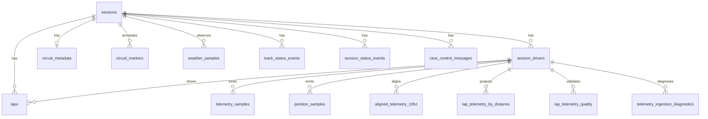

# Database Schema

This document explains the database shape for Race Telemetry Workbench. The
database is PostgreSQL with TimescaleDB enabled for high-volume sample tables.

The schema has three layers:

1. Session metadata and race context tables.
2. Time-series sample hypertables.
3. Analytical views used by the Query API and MCP server.

## Migration Order

Apply migrations in filename order:

| File | Purpose |
|---|---|
| `001_initial_schema.sql` | Creates base PostgreSQL tables and constraints. |
| `002_timescale_hypertables.sql` | Enables TimescaleDB, converts sample tables to hypertables, and adds indexes. |
| `003_analytical_views.sql` | Creates bounded views for API and MCP analytics. |
| `004_remove_composed_telemetry_columns.sql` | Removes obsolete composed telemetry columns from existing databases. |
| `005_query_hot_path_indexes.sql` | Adds indexes for bounded replay and analytical hot paths. |
| `006_aligned_telemetry_10hz.sql` | Adds 10 Hz UI-aligned telemetry and ingestion diagnostics tables. |
| `007_telemetry_domain_alignment.sql` | Adds explicit replay alignment semantics plus distance-domain lap telemetry and per-lap quality tables. |

When Docker initializes a fresh volume, PostgreSQL applies these files
automatically from `/docker-entrypoint-initdb.d`.

## Design Rules

- `session_id` is the top-level partitioning concept for product queries.
- Race sessions (`R`) are the default scope, but the schema accepts other
  FastF1 session codes for explicit opt-in imports.
- High-volume sample tables use absolute UTC time as the Timescale hypertable
  dimension.
- Session-relative time is still stored because replay, flags, weather, and MCP
  context windows are naturally expressed as milliseconds from session start.
- FastF1 source values that are useful but not query-critical go into `metadata`
  JSONB columns.
- The API and MCP server should prefer analytical views and bounded query
  endpoints instead of returning unbounded raw samples.

## Entity Relationship Overview

For a visual ER model, open `db/schema.dbml` in a DBML-compatible viewer such as
dbdiagram.io.



## Core Tables

### `sessions`

One row per imported FastF1 session.

Important columns:

| Column | Meaning |
|---|---|
| `session_id` | Stable project identifier such as `2024-italian-grand-prix-r`. |
| `year` | Championship year. |
| `event_name` | Official or importer-normalized event name. |
| `session_type` | FastF1 session code: `FP1`, `FP2`, `FP3`, `Q`, `SQ`, `S`, or `R`. |
| `session_start_utc` | Absolute start time when known. |
| `session_end_utc` | Absolute end time when known. |
| `source` | Source system, expected to be FastF1 for the first importer. |
| `metadata` | Source details that are not part of the stable query contract. |

### `session_drivers`

Drivers available in a session.

FastF1 sometimes exposes driver references as racing numbers. The importer
normalizes those references into `driver_code` values like `LEC`, `VER`, or
`HAM` and can retain the racing number in `driver_number`.

Primary key:

| Key | Purpose |
|---|---|
| `(session_id, driver_code)` | Allows the same driver code to appear in many sessions. |

### `laps`

Lap-level timing and tyre data for each driver.

Important columns:

| Column | Meaning |
|---|---|
| `lap_id` | Stable row identifier, usually derived from session, driver, and lap number. |
| `driver_code` | Normalized three-letter driver code. |
| `lap_number` | Positive lap number within the session. |
| `stint_number` | Driver stint where FastF1 provides it. |
| `lap_time_ms` | Full lap duration in milliseconds. |
| `sector_1_ms`, `sector_2_ms`, `sector_3_ms` | Sector durations in milliseconds. |
| `compound` | Tyre compound label from FastF1. |
| `tyre_life` | Tyre age from FastF1 when available. |
| `is_deleted` | Whether the lap was deleted. |
| `is_accurate` | FastF1 lap accuracy flag when available. |

The unique key `(session_id, driver_code, lap_number)` lets telemetry and
views join by natural lap identity.

## Time-Series Tables

### `telemetry_samples`

High-volume raw car telemetry from FastF1 `lap.get_car_data()`.

This is the main source for telemetry charts and time-aligned lap comparison.
It stores the source car channels directly and does not require a derived
distance or driver-ahead enrichment layer.

Time fields:

| Column | Meaning |
|---|---|
| `sample_time_utc` | Absolute sample timestamp and Timescale hypertable dimension. |
| `session_time_ms` | Milliseconds from session start. Best for replay windows. |
| `lap_time_ms` | Milliseconds from lap start. Best for lap charts. |

Core channel columns:

| Column | Meaning |
|---|---|
| `speed_kmh` | Speed in km/h. |
| `throttle_pct` | Throttle percentage, 0-100. |
| `brake_pct` | Brake percentage, normalized to 0 or 100 if FastF1 gives a boolean. |
| `gear` | Gear value from FastF1. |
| `rpm` | Engine RPM. |
| `drs` | FastF1 DRS state code. |
| `sample_source` | FastF1 source label for car data, usually `car`. |

Primary key:

| Key | Purpose |
|---|---|
| `(sample_time_utc, session_id, driver_code)` | Unique sample per driver at an absolute timestamp. |

### `position_samples`

High-volume raw position data from FastF1 `session.pos_data`.

This table powers replay positions and the data-derived track outline. The
product should not depend on external static track assets for the main outline.

Important columns:

| Column | Meaning |
|---|---|
| `sample_time_utc` | Absolute timestamp and Timescale hypertable dimension. |
| `x`, `y`, `z` | FastF1 track-map coordinates in source units. |
| `track_status` | FastF1 position status when available. |
| `sample_source` | Source label when available. |

### `aligned_telemetry_10hz`

This is the replay-oriented time-domain projection. It answers when something
happened, not where pace was gained or lost.

Important columns:

| Column | Meaning |
|---|---|
| `source_car_time`, `source_location_time` | Original source timestamps used for the aligned replay row. |
| `car_sample_age_ms`, `location_sample_age_ms` | Age of the chosen source sample relative to the replay timestamp. |
| `is_interpolated_car`, `is_interpolated_location` | Whether replay values were synthesized between source samples. |
| `quality_flags` | Replay-quality diagnostics for stale or gapped source data. |
| `alignment_method` | Named replay-alignment strategy used to build the row. |

### `lap_telemetry_by_distance`

This is the distance-domain lap projection. It answers where performance was
gained or lost by aligning laps onto common derived distance points.

Important columns:

| Column | Meaning |
|---|---|
| `distance_m` | Derived analytical lap distance, not surveyed circuit distance. |
| `normalized_track_progress` | Forward-compatible 0-1 normalized lap progress. |
| `lap_elapsed_time_ms` | Interpolated lap-elapsed time at the distance point. |
| `session_time_ms` | Interpolated session-relative time at the distance point. |
| `source_sample_before_time_utc`, `source_sample_after_time_utc` | Telemetry provenance bounds used for interpolation. |
| `interpolated` | Whether the point is synthetic between source samples. |
| `quality_flags` | Distance-domain quality diagnostics for the point. |

### `lap_telemetry_quality`

Objective per-lap distance-domain quality and validation metrics.

Important columns:

| Column | Meaning |
|---|---|
| `official_lap_duration_ms` | Authoritative lap time from timing data. |
| `telemetry_covered_duration_ms` | Covered raw telemetry span inside the lap window. |
| `maximum_car_data_gap_ms`, `maximum_position_gap_ms` | Largest source gaps seen while building the projection. |
| `final_integrated_distance_m` | Final derived analytical lap distance. |
| `distance_delta_validation_ms` | Difference between projected finish timing and official timing. |
| `quality_status`, `quality_messages` | Persisted validation state and warnings for API/MCP consumers. |

### `weather_samples`

Low-frequency weather observations from FastF1 `session.weather_data`.

Observed granularity is typically about one sample per minute, although the
schema does not assume a fixed interval. Weather is contextual data, not
high-frequency telemetry.

Important columns:

| Column | Meaning |
|---|---|
| `sample_time_utc` | Absolute weather timestamp and Timescale hypertable dimension. |
| `session_time_ms` | Weather sample time relative to session start. |
| `air_temp_c` | Air temperature in Celsius. |
| `track_temp_c` | Track temperature in Celsius. |
| `humidity_pct` | Relative humidity percentage. |
| `pressure_mbar` | Air pressure in millibar. |
| `rainfall` | Whether rain was reported. |
| `wind_direction_deg` | Wind direction in degrees. |
| `wind_speed_mps` | Wind speed in metres per second. |

## Circuit And Race Context

### `circuit_metadata`

One row per session with circuit-level values from
FastF1 `session.get_circuit_info()`.

`rotation_degrees` is used by the desktop app to orient the track map.

### `circuit_markers`

Annotations over the track outline.

Marker types:

| Marker type | Meaning |
|---|---|
| `corner` | Numbered or lettered corner marker. |
| `marshal_light` | Marshal light location. |
| `marshal_sector` | Marshal sector marker. |

These markers are annotations only. The rendered track outline should come from
imported `position_samples`.

### `track_status_events`

Compact status timeline from FastF1 `session.track_status`.

Known status codes:

| Code | Meaning |
|---|---|
| `1` | Track clear. |
| `2` | Yellow flag. |
| `4` | Safety car. |
| `5` | Red flag. |
| `6` | Virtual safety car deployed. |
| `7` | Virtual safety car ending. |

### `session_status_events`

Session lifecycle events from FastF1 `session.session_status`, such as started,
suspended, resumed, or finished.

### `race_control_messages`

Verbose race-control messages from FastF1. This table can include DRS messages,
pit-exit messages, investigations, flags, sector context, lap context, and
driver-specific notices.

Use this table for narrative/event search. Use `track_status_events` when the
query needs compact track-state periods.

## Analytical Views

The views in `003_analytical_views.sql` are intentionally bounded surfaces for
the Query API and MCP server. They make common analytical questions cheap and
model-friendly without streaming raw telemetry unless the user explicitly asks
for replay or lap-comparison data.

### `lap_summaries`

Purpose:

| Output | Meaning |
|---|---|
| One row per session, driver, lap | Keeps the lap as the main unit of analysis. |
| Lap and sector timing | Comes directly from `laps`. |
| Tyre and pit fields | Comes directly from `laps`. |
| `max_speed_kmh` | Maximum telemetry speed for the lap. |
| `avg_speed_kmh` | Average telemetry speed for the lap. |
| `avg_throttle_pct` | Average throttle for the lap. |
| `avg_brake_pct` | Average brake value for the lap. |
| `telemetry_samples` | Count of telemetry rows joined to the lap. |

Logic:

`lap_summaries` starts from `laps` and `LEFT JOIN`s `telemetry_samples` on
`session_id`, `driver_code`, and `lap_number`. The left join is deliberate:
laps remain visible even when telemetry is missing or skipped. Aggregate values
will be `NULL` for missing telemetry, and `telemetry_samples` will be `0`.

Use cases:

- List a driver's laps with timing and rough pace context.
- Answer MCP questions like "which lap was fastest for LEC?"
- Identify laps with missing telemetry before asking for detailed samples.

### `driver_stint_summaries`

Purpose:

| Output | Meaning |
|---|---|
| One row per session, driver, stint, compound | Groups lap data into tyre stints. |
| `first_lap_number`, `last_lap_number` | Stint lap range. |
| `laps` | Number of laps in the stint. |
| `min_tyre_life`, `max_tyre_life` | Observed tyre-life range. |
| `avg_lap_time_ms` | Average lap time across the stint. |
| `best_lap_time_ms`, `worst_lap_time_ms` | Simple pace spread. |

Logic:

Rows with `stint_number IS NULL` are excluded because they cannot be assigned
to a reliable stint group. The view groups by `session_id`, `driver_code`,
`stint_number`, and `compound`.

Use cases:

- Compare tyre stints between drivers.
- Summarize degradation trends before adding richer per-lap regression logic.
- Give MCP a compact answer for "how did the medium stint look?"

### `session_weather_summary`

Purpose:

| Output | Meaning |
|---|---|
| One row per session | Summarizes the full weather timeline. |
| Min/max/avg temperatures | Air and track temperature ranges. |
| Min/max/avg humidity and pressure | Ambient condition ranges. |
| `avg_wind_speed_mps` | Average wind speed. |
| `rainfall_observed` | True if any sample reports rain. |

Logic:

The view aggregates all rows in `weather_samples` by `session_id`.
`rainfall_observed` uses `bool_or(coalesce(rainfall, false))`, so missing
rainfall values do not create unknown truth values.

Use cases:

- Display session-level weather context.
- Answer "was the race wet?" without scanning raw weather samples.
- Provide context for lap comparison and replay.

### `track_status_periods`

Purpose:

| Output | Meaning |
|---|---|
| `start_time_ms` | Status event start time relative to session start. |
| `end_time_ms` | Next status event time in the same session. |
| `status_code` | Original FastF1 status code. |
| `status_name` | Human-readable normalized status. |

Logic:

FastF1 track status is event-based. The view turns each event into a period by
using `lead(event_time_ms)` partitioned by `session_id`. The last event in a
session has `NULL end_time_ms` because the database cannot infer the final bound
without using session-end context.

Use cases:

- Shade replay timelines for safety car, VSC, yellow flag, and red flag.
- Find laps or telemetry windows affected by track status.
- Answer "when was the safety car?" from compact periods.

### `race_control_event_index`

Purpose:

| Output | Meaning |
|---|---|
| Race-control fields | Category, flag, status, scope, sector, lap, and driver context. |
| `search_text` | Lowercase combined text for simple bounded search. |

Logic:

The view projects `race_control_messages` and builds `search_text` with
`lower(concat_ws(' ', ...))`. `concat_ws` skips `NULL` values, so sparse source
messages still produce useful searchable text.

Use cases:

- Search for DRS, investigation, flag, or driver-specific messages.
- Show race-control timeline markers in the desktop app.
- Give MCP a compact event index before fetching details.

### `telemetry_event_candidates`

Purpose:

| Event type | Rule |
|---|---|
| `hard_braking` | `brake_pct >= 80` |
| `high_speed` | `speed_kmh >= 300` |
| `drs_active` | `drs IS NOT NULL AND drs > 0` |
| `throttle_lift` | `throttle_pct <= 10 AND speed_kmh >= 150` |

Logic:

The view filters `telemetry_samples` to rows that match one of the simple event
thresholds. The `CASE` expression labels each row with the first matching event
type in priority order. The thresholds are intentionally simple and should be
treated as candidates, not final motorsport interpretation.

Use cases:

- Answer MCP questions like "find hard braking events".
- Seed event search endpoints without scanning every telemetry row in app code.
- Give the future Query API a bounded starting point for richer filters.

## Indexing Notes

The second migration adds indexes around the first planned query patterns:

| Index | Query pattern |
|---|---|
| `ix_sessions_year_event_session` | Session picker and MCP `list_sessions`. |
| `ix_laps_session_driver_lap` | Driver lap lists and lap lookup. |
| `ix_telemetry_session_driver_lap_time` | Per-lap time-aligned comparison and chart queries. |
| `ix_telemetry_session_time` | Replay and timeline windows. |
| `ix_telemetry_session_driver_session_time` | Driver replay slices. |
| `ix_position_session_driver_time` | Track replay positions. |
| `ix_weather_samples_session_time` | Weather lookup by replay time. |
| `ix_track_status_events_session_time` | Timeline context windows. |
| `ix_race_control_messages_session_time` | Race-control timeline. |
| `ix_race_control_messages_session_lap` | Lap-scoped race-control lookup. |

## Example Queries

List imported sessions:

```sql
SELECT session_id, year, event_name, session_type
FROM sessions
ORDER BY year DESC, event_name, session_type;
```

Get lap summaries for one driver:

```sql
SELECT lap_number, lap_time_ms, compound, tyre_life, max_speed_kmh
FROM lap_summaries
WHERE session_id = '2024-italian-grand-prix-r'
  AND driver_code = 'LEC'
ORDER BY lap_number;
```

Find safety-car periods:

```sql
SELECT start_time_ms, end_time_ms, status_name
FROM track_status_periods
WHERE session_id = '2024-italian-grand-prix-r'
  AND status_name IN ('safety_car', 'virtual_safety_car_deployed')
ORDER BY start_time_ms;
```

Search race-control messages:

```sql
SELECT session_time_ms, lap_number, category, message
FROM race_control_event_index
WHERE session_id = '2024-italian-grand-prix-r'
  AND search_text LIKE '%drs%'
ORDER BY session_time_ms;
```
