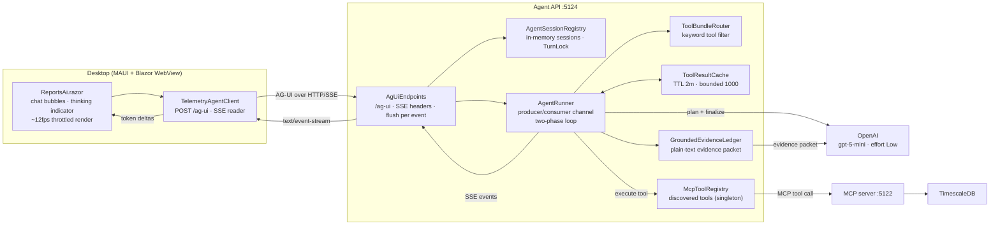
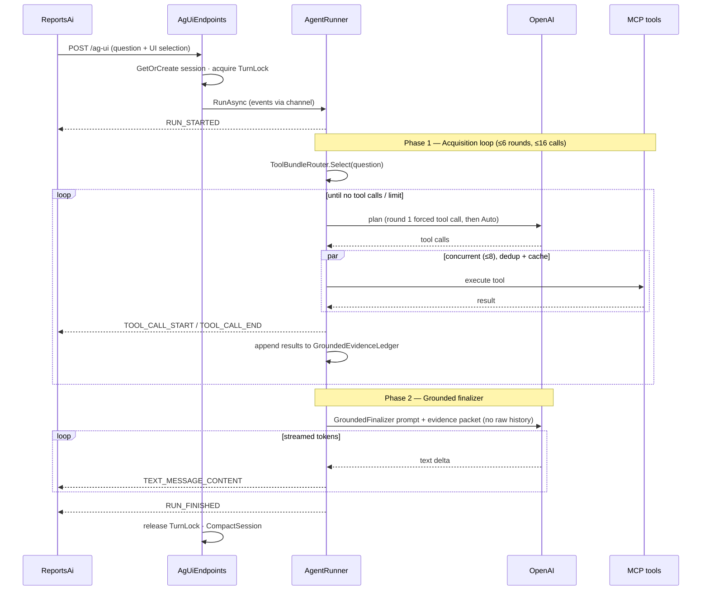

# Chat → Agent → MCP Pipeline

How a question typed in the desktop **Reports & AI** view becomes a grounded,
streamed answer — and the optimizations that keep it fast, cheap, and accurate.

This is the deep version of the "Data flow for a chat question" summary in the
[README](../README.md#system-interaction).

## Component map

## The components

| Component | File | Role |
|-----------|------|------|
| Chat UI | `src/RaceTelemetry.UiKit/Components/ReportsAi.razor` | Renders bubbles, streams token deltas (throttled ~12fps), shows the thinking / tool-status indicator, parses follow-up chips. |
| SSE client | `src/RaceTelemetry.UiKit/Services/TelemetryAgentClient.cs` | POSTs the question + UI selection to `/ag-ui`, reads the SSE stream line-by-line, yields `AgUiClientEvent`s. |
| Endpoint | `src/RaceTelemetry.AgentApi/AgUi/AgUiEndpoints.cs` | Sets SSE headers, resolves the session, serialises turns, writes **and flushes** each event. |
| Session registry | `src/RaceTelemetry.AgentApi/Sessions/AgentSessionRegistry.cs` | In-memory sessions keyed by a validated UUID `threadId`; capacity + idle eviction. |
| Orchestrator | `src/RaceTelemetry.AgentApi/AgUi/AgentRunner.cs` | The two-phase agentic loop; produces AG-UI events onto a channel. |
| Tool router | `src/RaceTelemetry.Agent/ToolBundleRouter.cs` | Picks a per-question subset of tools by keyword. |
| Tool cache | `src/RaceTelemetry.AgentApi/AgUi/ToolResultCache.cs` | Process-local cache of successful read-only tool results. |
| Evidence ledger | `src/RaceTelemetry.AgentApi/AgUi/GroundedEvidence.cs` | Collects tool output into a clean plain-text evidence packet for the finalizer. |
| MCP registry | `src/RaceTelemetry.Agent/McpToolRegistry.cs` | Connects to the MCP server once at startup, discovers tools as `AIFunction`s. |

## A turn, end to end

The Agent API does **not** run a single model loop that both calls tools and
writes the answer. It splits into two phases: an **acquisition loop** that
gathers grounded evidence, and a **grounded finalizer** that writes the answer
from that evidence alone. Only the finalizer's tokens stream to the user.

**Phase 1 — Acquisition** (`AgentRunner.ProduceEventsAsync`, `RunAsync`):
the system prompt is `AgentInstructions.Acquisition` plus trimmed history. Round
one forces a tool call (`ChatToolMode.RequireAny`) so the ledger always has
grounded evidence; subsequent rounds switch to `Auto`. Each round streams a
planning response, executes the requested tool calls as a concurrent batch, and
appends results to both the message list and the `GroundedEvidenceLedger`. The
loop ends when the model stops requesting tools or hits `MaximumToolRounds` /
`MaximumToolCalls`.

**Phase 2 — Grounded finalizer** (`StreamVerifiedFinalAnswerAsync`): a *separate*
LLM call seeded with `AgentInstructions.GroundedFinalizer` and the evidence
packet — **not** the raw tool JSON or full history. The ledger renders evidence
as numbered plain-text lines (`GroundedEvidenceLedger.BuildPrompt`) precisely so
a small model treats it as source material to summarise rather than JSON to echo
back. These are the only tokens the user sees stream.

## Optimizations

Grouped by what they protect: **accuracy**, **cost/latency**, and **responsiveness**.

### Accuracy & grounding

- **Two-phase acquire-then-ground split.** The finalizer never sees raw tool
  JSON, only the plain-text evidence packet — small models stop echoing JSON
  blobs as "answers." `AgentRunner.StreamVerifiedFinalAnswerAsync`, `GroundedEvidence.cs`.
- **Forced first tool call.** `ChatToolMode.RequireAny` on round one guarantees
  the ledger is never empty (which otherwise produced a "no usable evidence"
  fallback). `AgentRunner.cs:126`.
- **Evidence de-duplication & MCP unwrapping.** The ledger unwraps the MCP
  `{"content":[{"text":...}]}` envelope and strips the duplicated `facts` array
  so the packet is clean, compact data. `GroundedEvidence.cs`.

### Cost & latency

- **Tool routing by keyword.** `ToolBundleRouter` hands the planner only the
  tools relevant to the question (~3–10 instead of ~25), cutting prompt tokens
  and sharpening tool selection. `ToolBundleRouter.cs`.
- **Cross-run tool-result cache.** Successful read-only results are cached
  process-wide (TTL `ToolResultCacheTtl` = 2 min, bounded `MaximumCachedToolResults`
  = 1000, oldest-evicted). Repeated questions skip the MCP/DB round trip.
  `ToolResultCache.cs`; hit/miss counters in `AgentTelemetry`.
- **In-run call de-duplication.** Identical tool calls within a single run share
  one `Task`, keyed by **canonical** (sorted-key) JSON so argument ordering
  doesn't defeat it. `AgentRunner.BuildCallKey` / `deduplicatedCalls`.
- **Concurrent tool execution.** A batch runs under a `SemaphoreSlim`
  (`MaximumConcurrentToolCalls` = 8), completing via `Task.WhenAny` so each
  `TOOL_CALL_END` fires as soon as that tool finishes. `AgentRunner.ExecuteToolBatchAsync`.
- **Bounded everything.** Reasoning effort `Low`, capped `MaxOutputTokens`
  (planning 1500 / final 2500), `MaximumToolRounds` 6, `MaximumToolCalls` 16,
  per-call `ToolCallTimeout` 15s, result truncation 20k chars, evidence cap 60k.
  `TelemetryAgentOptions.cs`.
- **Context-window trimming.** History is capped at `MaxContextMessages` = 20
  (~10 turns); `CompactSession` trims after each turn. `AgentRunner.cs`.

### Responsiveness / streaming

- **Producer/consumer channel.** The runner produces events on a background
  `Task.Run` writing to an unbounded `Channel`; the endpoint consumes and flushes
  them. Model work never blocks the SSE writer. `AgentRunner.RunAsync`.
- **Per-event flush + no proxy buffering.** Each SSE event is written and
  `FlushAsync`'d immediately, with `X-Accel-Buffering: no` and `Cache-Control:
  no-cache` so tokens arrive as produced. `AgUiEndpoints.cs`.
- **Non-blocking client read.** The SSE reader loops on `ReadLineAsync` (not the
  synchronous, thread-blocking `StreamReader.EndOfStream`), keeping the MAUI
  WebView UI thread free during streaming. `TelemetryAgentClient.cs`.
- **Throttled live render.** Token deltas are coalesced to ~12fps (80ms) and
  markdown is rendered continuously, avoiding per-token re-render churn and the
  end-of-stream HTML swap; the question bubble paints immediately via an eager
  `StateHasChanged`. `ReportsAi.razor`.
- **Live thinking / tool status.** While a tool runs the UI shows
  "Looking up <source>…" driven off the streamed `TOOL_CALL_START/END` events.
  `ReportsAi.razor`.

### Concurrency & isolation

- **Per-session turn serialization.** A `TurnLock` (10s acquire) serialises turns
  on one `threadId` while different sessions run concurrently. State is in-memory,
  UUID-validated, capacity-bounded (250), idle-evicted (1h). `AgUiEndpoints.cs`,
  `AgentSessionRegistry.cs`.

## Tuning

All knobs live in `TelemetryAgentOptions` (config section `TelemetryAgent`,
bound in `appsettings.json`). Set `ToolResultCacheTtl` to `0` to disable
cross-run caching (in-run dedup still applies).
