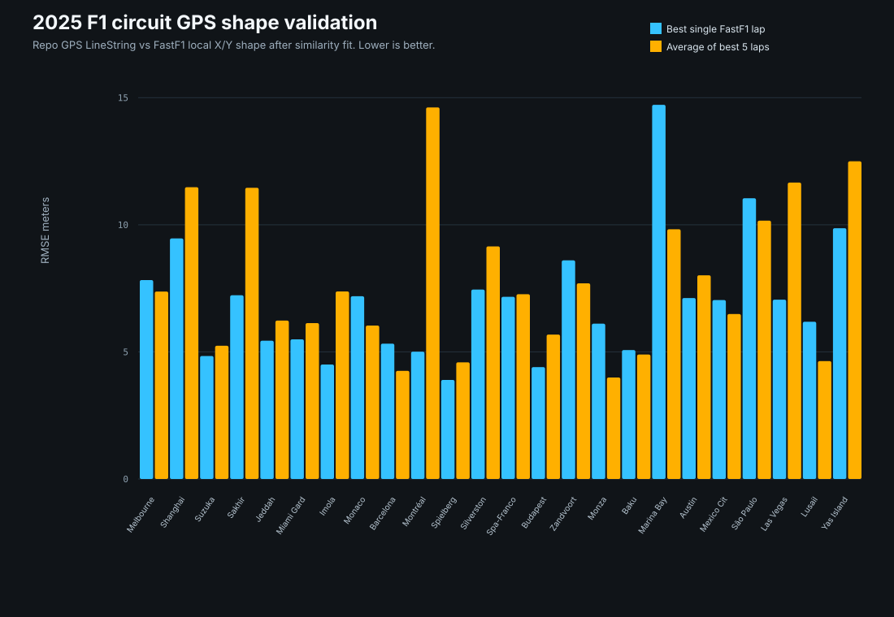
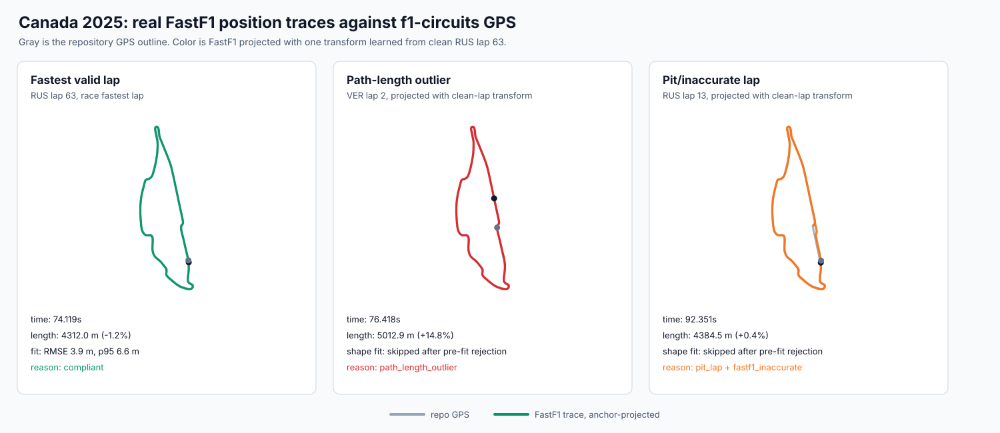
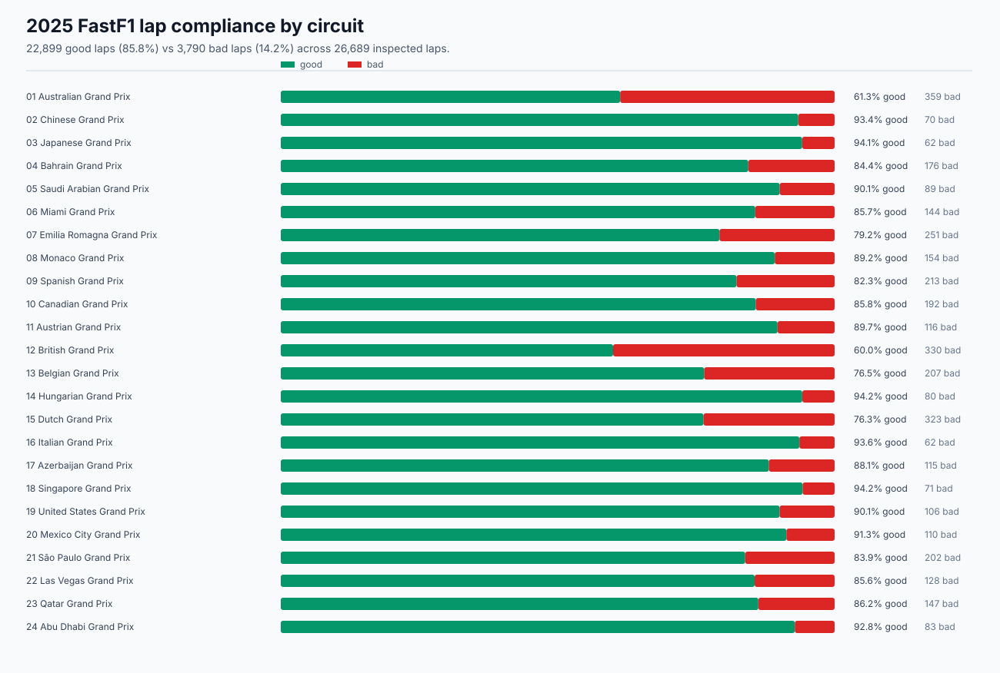
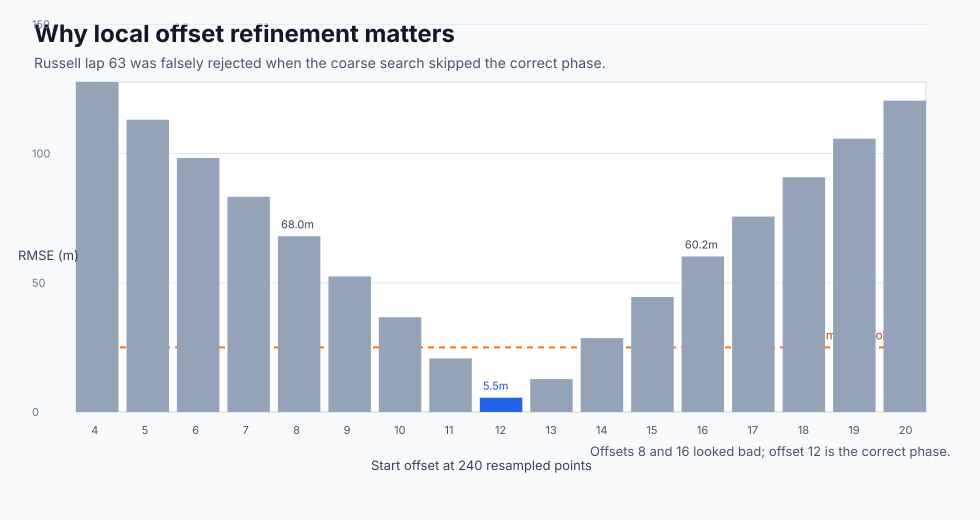
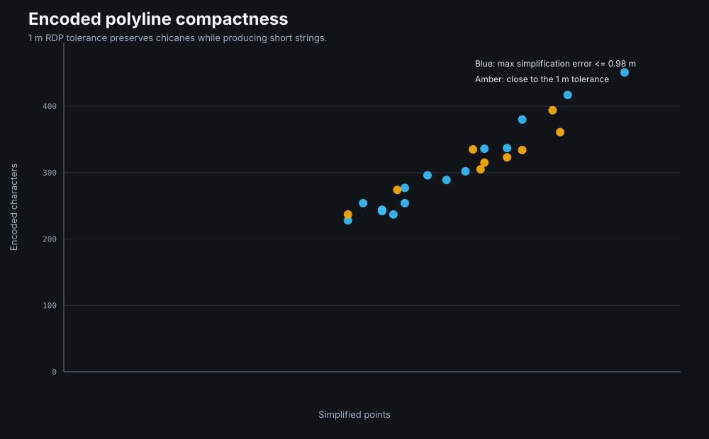

# Apexline

**Apexline validates Formula 1 circuit GPS outlines against real FastF1 lap
position data, identifies laps that are unsafe to use as geometry references,
and exports compact encoded polylines for maps and spatial tooling.**

It started as a simple question:

> Can I trust a circuit GPS LineString enough to encode it as a polyline without
> cutting chicanes or silently accepting bad telemetry?

The answer is: yes, but only if you validate the shape and the laps first.



## What Makes This Useful

FastF1 does **not** provide latitude/longitude telemetry for cars. It provides
local circuit `X/Y/Z` position channels. That means you cannot directly ask:

```text
How many GPS meters away was this car from this coordinate?
```

But you can ask something almost as useful:

```text
Does this GPS circuit outline have the same shape as real driven FastF1 laps?
```

Apexline answers that with a geometry fit:

```text
bacinger/f1-circuits GPS LineString
        +
FastF1 local X/Y lap positions
        |
        v
projection to local meters
        |
        v
closed-path resampling
        |
        v
phase + direction search
        |
        v
scale / rotate / translate fit
        |
        v
RMSE, p50, p95, max error
        |
        v
validated encoded polyline
```

The result is a practical cross-validation tool for:

- finding laps that should not be used as shape references,
- detecting suspicious GPS circuit outlines,
- selecting clean representative laps from FastF1,
- simplifying GPS polylines without destroying tight corners,
- producing metrics that explain *why* a lap or line was accepted.

## Real Canada 2025 Example

Canada 2025 is a good stress test because the lap is compact, chicane-heavy,
and sensitive to start/finish phase alignment.

After validation, Apexline found:

| Metric | Value |
|---|---:|
| Total laps inspected | 1349 |
| Laps fitted against GPS shape | 1157 |
| Compliant laps | 1157 |
| Non-compliant laps | 192 |
| Shape non-compliant laps | 0 |
| Fastest lap | RUS lap 63, 74.119 s |
| Fastest lap fit RMSE | 5.54 m |
| Fastest lap fit p95 | 8.51 m |
| Repository GPS polyline points | 84 |
| Polyline simplification max error | 0.95 m |

Non-compliant reason counts are intentionally not mutually exclusive:

| Reason | Count |
|---|---:|
| `fastf1_inaccurate` | 152 |
| `pit_lap` | 131 |
| `path_length_outlier` | 42 |
| `missing_lap_time` | 3 |
| `too_few_position_samples` | 1 |
| `shape_rmse_over_threshold` | 0 |
| `shape_p95_over_threshold` | 0 |

That distinction matters. A lap can be a real race lap and still be a bad
reference for circuit geometry. Apexline keeps those cases explicit.

## Bad Lap Examples From Real FastF1 Positions

The figure below is generated by
[`scripts/plot_canada_lap_examples.py`](scripts/plot_canada_lap_examples.py)
from actual Canada 2025 FastF1 position samples.

Gray is the GPS outline from
[`bacinger/f1-circuits`](https://github.com/bacinger/f1-circuits). The colored
line is the FastF1 trace projected through one transform learned from a clean
anchor lap, Russell lap 63. Rejected laps are not allowed to learn their own
rotation or translation for this figure, because that can hide the failure mode.



Three different cases are visible:

| Case | What Apexline Sees | Why It Matters |
|---|---|---|
| RUS lap 63 | Fastest lap, clean shape fit, RMSE 3.9 m with fine search | Used as the anchor transform for the figure |
| VER lap 2 | 5012.9 m measured path on a 4365.0 m reference, +14.8% | Rejected before shape fitting as a lap-boundary/path-length outlier |
| RUS lap 13 | Pit-in lap, FastF1 marks it inaccurate, 92.351 s | Projected for inspection, but not shape-fitted |

This is the core value: the script does not just compute a score. It explains
why a lap is useful, suspicious, or invalid for this specific geometry task.

## 2025 All-Circuit Lap Quality

The 2025 season run inspected every race lap available through FastF1 and
classified whether it is suitable as a geometry-reference lap.



Season totals:

| Metric | Value |
|---|---:|
| Circuits | 24 |
| Total laps inspected | 26,689 |
| Fitted laps | 23,002 |
| Good laps | 22,899 (85.8%) |
| Bad laps | 3,790 (14.2%) |
| Shape-threshold bad laps | 103 |

Rejection signals are not mutually exclusive; one lap can be both a pit lap and
FastF1-inaccurate.

| Reason | Count |
|---|---:|
| `fastf1_inaccurate` | 3,646 |
| `pit_lap` | 1,625 |
| `missing_lap_time` | 352 |
| `shape_rmse_over_threshold` | 100 |
| `path_length_outlier` | 93 |
| `too_few_position_samples` | 19 |
| `shape_p95_over_threshold` | 18 |

Per-circuit good vs bad laps:

| Round | Event | Good | Bad | Total | Good % | Shape Bad |
|---:|---|---:|---:|---:|---:|---:|
| 1 | Australian Grand Prix | 568 | 359 | 927 | 61.3% | 0 |
| 2 | Chinese Grand Prix | 995 | 70 | 1,065 | 93.4% | 0 |
| 3 | Japanese Grand Prix | 997 | 62 | 1,059 | 94.1% | 0 |
| 4 | Bahrain Grand Prix | 952 | 176 | 1,128 | 84.4% | 0 |
| 5 | Saudi Arabian Grand Prix | 809 | 89 | 898 | 90.1% | 1 |
| 6 | Miami Grand Prix | 861 | 144 | 1,005 | 85.7% | 0 |
| 7 | Emilia Romagna Grand Prix | 956 | 251 | 1,207 | 79.2% | 0 |
| 8 | Monaco Grand Prix | 1,271 | 154 | 1,425 | 89.2% | 0 |
| 9 | Spanish Grand Prix | 990 | 213 | 1,203 | 82.3% | 0 |
| 10 | Canadian Grand Prix | 1,157 | 192 | 1,349 | 85.8% | 0 |
| 11 | Austrian Grand Prix | 1,010 | 116 | 1,126 | 89.7% | 0 |
| 12 | British Grand Prix | 495 | 330 | 825 | 60.0% | 1 |
| 13 | Belgian Grand Prix | 672 | 207 | 879 | 76.5% | 75 |
| 14 | Hungarian Grand Prix | 1,288 | 80 | 1,368 | 94.2% | 0 |
| 15 | Dutch Grand Prix | 1,041 | 323 | 1,364 | 76.3% | 0 |
| 16 | Italian Grand Prix | 912 | 62 | 974 | 93.6% | 4 |
| 17 | Azerbaijan Grand Prix | 853 | 115 | 968 | 88.1% | 2 |
| 18 | Singapore Grand Prix | 1,158 | 71 | 1,229 | 94.2% | 5 |
| 19 | United States Grand Prix | 961 | 106 | 1,067 | 90.1% | 2 |
| 20 | Mexico City Grand Prix | 1,153 | 110 | 1,263 | 91.3% | 0 |
| 21 | Sao Paulo Grand Prix | 1,049 | 202 | 1,251 | 83.9% | 0 |
| 22 | Las Vegas Grand Prix | 758 | 128 | 886 | 85.6% | 2 |
| 23 | Qatar Grand Prix | 920 | 147 | 1,067 | 86.2% | 2 |
| 24 | Abu Dhabi Grand Prix | 1,073 | 83 | 1,156 | 92.8% | 9 |

The full generated table, including top rejection signals per circuit, is in
[docs/lap-compliance-2025.md](docs/lap-compliance-2025.md).

## Rejected Lap Galleries

For deeper inspection, Apexline can render every rejected lap for selected
events. Each panel shows the GPS reference in gray and the rejected FastF1 lap
projected with one clean anchor-lap transform for that event. Rejected laps do
not learn their own rotation or translation, so the visual does not hide the
failure mode. By default these audit galleries render raw position points
without thinning; `--max-render-points` is available only if smaller SVGs are
more important than corner-level fidelity.

Generated 2025 galleries:

| Event | Rejected laps | Gallery | Data |
|---|---:|---|---|
| Canadian Grand Prix | 192 | [SVG](docs/assets/rejected-laps-2025/10-canadian-grand-prix.svg) | [JSON](docs/assets/rejected-laps-2025/10-canadian-grand-prix.json) |
| Australian Grand Prix | 359 | [SVG](docs/assets/rejected-laps-2025/01-australian-grand-prix.svg) | [JSON](docs/assets/rejected-laps-2025/01-australian-grand-prix.json) |
| British Grand Prix | 330 | [SVG](docs/assets/rejected-laps-2025/12-british-grand-prix.svg) | [JSON](docs/assets/rejected-laps-2025/12-british-grand-prix.json) |

The gallery index is available at
[docs/rejected-lap-galleries-2025.md](docs/rejected-lap-galleries-2025.md).

Generate the same galleries:

```bash
.venv/bin/python scripts/plot_rejected_lap_galleries.py \
  --year 2025 \
  --circuits Canada Australia British
```

## A Bug The Analysis Caught

The first Canada run incorrectly marked Russell's fastest lap as
shape-non-compliant with about 60 m RMSE. That looked wrong, so the lap was
explored by offset.

The issue was not FastF1. It was the phase search.

At 240 resampled points, the correct phase offset was `12`. A coarse search
with step `8` tried offsets `8` and `16`, but skipped `12`.



The validator now performs:

1. a coarse offset search for speed,
2. a local refinement around the best coarse offset,
3. the same check in both forward and reversed directions.

This is the kind of detail that matters on compact tracks and chicane-heavy
layouts. A validator that cannot explain its own false positive is not finished.

## Algorithm

### 1. Load GPS Reference

Apexline loads a circuit LineString from
[`bacinger/f1-circuits`](https://github.com/bacinger/f1-circuits):

```text
circuits/ca-1978.geojson
```

The coordinates are WGS84 longitude/latitude. The script converts them into a
local meter plane using an equirectangular projection around the circuit
centroid. For circuit-scale distances, this is accurate enough for shape
comparison and avoids heavier GIS dependencies.

### 2. Load FastF1 Position Samples

For a requested `year` and `circuit`, Apexline loads the race session and
extracts each lap's local FastF1 position stream:

```python
lap.get_pos_data()[["X", "Y"]]
```

FastF1 positions are local track coordinates, not GPS. Apexline treats them as
shape evidence.

### 3. Reject Laps That Are Not Geometry References

Before expensive shape fitting, each lap gets classified:

| Check | Reason |
|---|---|
| `IsAccurate` is false | `fastf1_inaccurate` |
| pit-in or pit-out is present | `pit_lap` |
| lap time missing | `missing_lap_time` |
| too few position points | `too_few_position_samples` |
| path length differs by more than 5% | `path_length_outlier` |

This is where the tool is useful beyond map generation. It separates "available
position data" from "position data suitable for validating a circuit shape."

### 4. Fit FastF1 Shape To GPS Shape

For each usable lap:

1. Close the FastF1 and GPS paths.
2. Resample both by equal path progress.
3. Try forward and reversed direction.
4. Search circular start offsets.
5. Fit FastF1 to GPS with a similarity transform:

```text
target ~= scale * rotation * source + translation
```

This is a Procrustes-style fit in 2D. It intentionally allows translation,
rotation, and scale because FastF1's local coordinate system is not GPS.

The important part is what it does **not** allow: arbitrary warping. If the
shape is wrong, the residual errors stay high.

### 5. Report Shape Error

Apexline reports:

| Metric | Meaning |
|---|---|
| `rmse_m` | overall fit error |
| `p50_m` | median pointwise error |
| `p95_m` | high-end error without overreacting to one sample |
| `max_m` | worst pointwise error |
| `rotation_degrees` | fitted orientation difference |
| `scale_m_per_fastf1_unit` | inferred FastF1 unit scale |
| `start_offset_samples` | phase alignment used for the fit |

For compliance, the default shape thresholds are:

```text
RMSE <= 25 m
p95  <= 50 m
```

Those thresholds are deliberately loose enough to tolerate racing-line
differences, but strict enough to reject obvious shape mismatches.

### 6. Simplify And Encode The GPS Polyline

Once the GPS line is validated, Apexline simplifies it with
Ramer-Douglas-Peucker using a meter tolerance, then encodes it with Google's
encoded polyline format.

The default tolerance is conservative:

```text
polyline tolerance = 1.0 m
```

For Canada 2025, that produced:

| Artifact | Value |
|---|---:|
| Source GPS points | 102 |
| Simplified points | 84 |
| Encoded characters | 242 |
| Max simplification error | 0.95 m |
| Length delta | -0.39 m |



## Quick Start

```bash
python3 -m venv .venv
.venv/bin/python -m pip install -r requirements.txt
```

Run one circuit:

```bash
.venv/bin/python scripts/analyze_f1_circuit_gps.py \
  --year 2025 \
  --circuit Canada \
  --output-json data/canada-2025-analysis.json \
  --output-csv data/canada-2025-analysis.csv \
  --lap-diagnostics-output data/canada-2025-lap-diagnostics.json \
  --validation-samples 720 \
  --validation-offset-step 4 \
  --lap-diagnostics-samples 240 \
  --lap-diagnostics-offset-step 8 \
  --polyline-tolerance-m 1.0 \
  --max-shape-candidates 12 \
  --average-laps 5 \
  --average-samples 720
```

Generate the Canada diagnostic figures:

```bash
.venv/bin/python scripts/plot_canada_lap_examples.py
```

Generate rejected-lap galleries for selected events:

```bash
.venv/bin/python scripts/plot_rejected_lap_galleries.py \
  --year 2025 \
  --circuits Canada Australia British
```

Run the full 2025 season:

```bash
.venv/bin/python scripts/analyze_f1_circuit_gps.py \
  --year 2025 \
  --output-json data/circuit-polylines-2025.json \
  --output-csv data/circuit-polylines-2025.csv \
  --lap-diagnostics-output data/lap-diagnostics-2025.json \
  --validation-samples 720 \
  --validation-offset-step 4 \
  --lap-diagnostics-samples 240 \
  --lap-diagnostics-offset-step 8 \
  --polyline-tolerance-m 1.0 \
  --max-shape-candidates 12 \
  --average-laps 5 \
  --average-samples 720
```

Summarize lap quality for any generated year:

```bash
.venv/bin/python scripts/summarize_lap_diagnostics.py --year 2025
```

The scripts are year-driven. To run a different season, change `--year` and the
output filenames, for example `--year 2024` with
`data/lap-diagnostics-2024.json`.

You need FastF1 race data available in `data/fastf1-cache`, or network access
so FastF1 can download it. The `bacinger/f1-circuits` repository is cloned into
`/tmp/f1-circuits` by default if missing.

## Outputs

### Circuit Analysis JSON

`data/canada-2025-analysis.json` contains the circuit-level result:

| Field | Meaning |
|---|---|
| `encoded_polyline` | validated GPS polyline |
| `repo_vs_fastf1` | best single FastF1 lap fit metrics |
| `averaged_fastf1_encoded_polyline` | fitted average of the best FastF1 laps |
| `repo_vs_fastf1_average` | GPS vs averaged FastF1 metrics |
| `lap_compliance_summary` | lap-level quality summary |
| `polyline_vs_source` | simplification loss from source GPS |
| `polyline_vs_fastf1` | simplified polyline vs FastF1 shape |

### Lap Diagnostics JSON

`data/canada-2025-lap-diagnostics.json` explains compliance:

| Field | Meaning |
|---|---|
| `total_laps` | all laps inspected |
| `fitted_laps` | laps that passed pre-fit checks |
| `compliant_laps` | laps passing all checks |
| `reason_counts` | count by rejection reason |
| `fastest_lap_with_position` | fastest lap with enough position samples |
| `fastest_compliant_lap` | fastest lap that passes all checks |
| `worst_shape_laps` | laps that failed shape thresholds |
| `worst_fitted_laps` | highest-error fitted laps, even if still compliant |

### Season Lap Compliance

`data/lap-diagnostics-2025.json` is the all-circuit lap-quality source. The
summary command creates:

| File | Purpose |
|---|---|
| `docs/lap-compliance-2025.md` | markdown season table |
| `docs/assets/lap-compliance-2025.svg` | good-vs-bad circuit visual |

## 2025 Headline Results

For the generated 2025 season data:

| Metric | Value |
|---|---:|
| Circuits processed | 24 |
| Best single-lap mean RMSE | 6.5 m |
| Best single-lap median RMSE | 6.2 m |
| Average-of-5 mean RMSE | 7.1 m |
| Average-of-5 median RMSE | 6.5 m |
| Circuits improved by averaging | 12 / 24 |
| Max simplification error | <= 1.0 m |

Averaging is not automatically better. FastF1 traces are driven racing lines;
the repository GPS line is usually closer to a centerline. Apexline keeps both
numbers so that decision is visible instead of assumed.

## Engineering Notes

This is a focused telemetry-validation project for turning noisy public F1 data
into reproducible, inspectable circuit-line evidence. The important parts:

- It reconciles two coordinate systems without pretending they are the same.
- It uses geometry, not screenshots, to validate track outlines.
- It classifies data quality before calculating expensive metrics.
- It produces explainable failure reasons, not just pass/fail.
- It caught and fixed a false positive in its own validator.
- It generates reproducible visual evidence from real telemetry samples.
- It keeps polyline compression conservative enough to preserve chicanes.

The main engineering choice is restraint: no arbitrary warping, no invented GPS
for FastF1, and no treating a lap as usable just because position samples exist.

## Documentation

- [Canada 2025 fastest-lap EDA](docs/canada-2025-fastest-lap-eda.md)
- [2025 lap compliance summary](docs/lap-compliance-2025.md)
- [2025 rejected lap galleries](docs/rejected-lap-galleries-2025.md)
- [2025 validation summary](docs/2025-validation-summary.md)
- [Parameter guide](docs/parameter-guide.md)
- [Cross-validation writeup](docs/cross-validation-writeup.md)

## Data Sources

- GPS circuit outlines:
  [`bacinger/f1-circuits`](https://github.com/bacinger/f1-circuits)
- FastF1 session and position data:
  [`FastF1`](https://docs.fastf1.dev/)

The fit metrics are shape-validation metrics, not absolute GPS telemetry error.
FastF1 local `X/Y` data is used as independent shape evidence, not as latitude
and longitude.

## Repository Name

Suggested repo name: **apexline**.

It is short, motorsport-specific, and describes the core artifact: a validated
track line.
